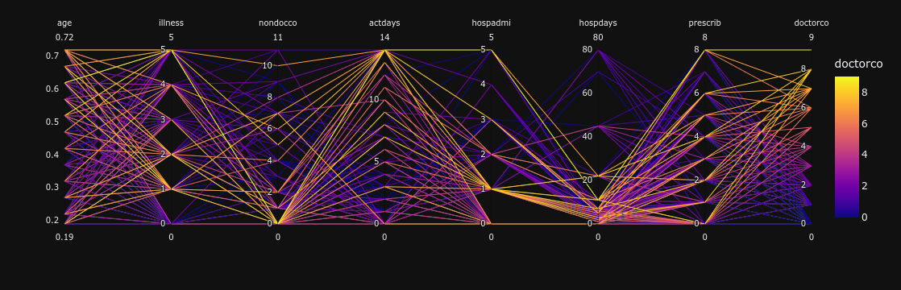
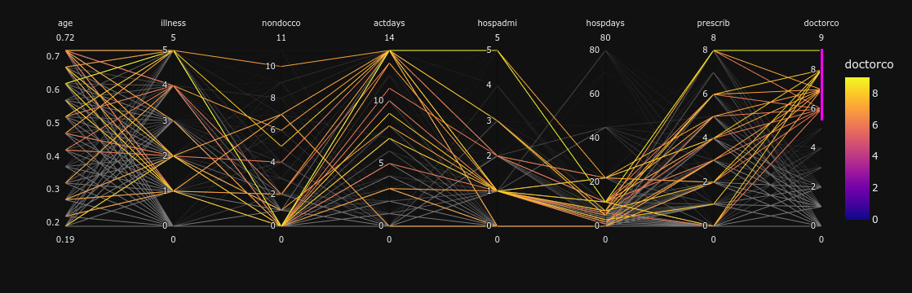
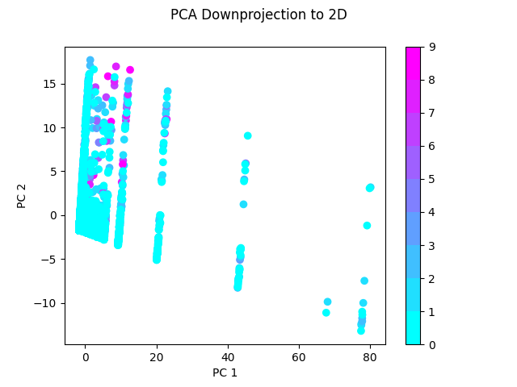
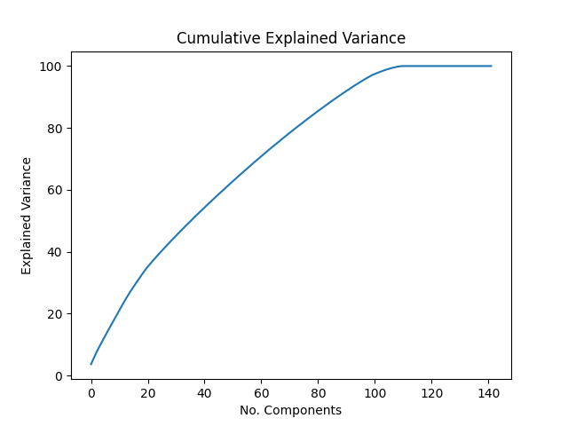
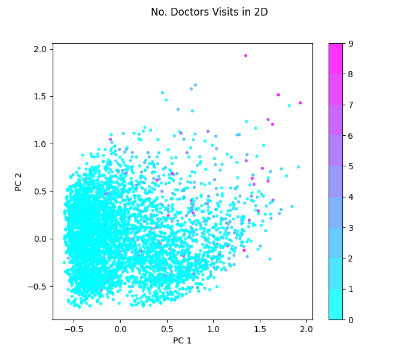
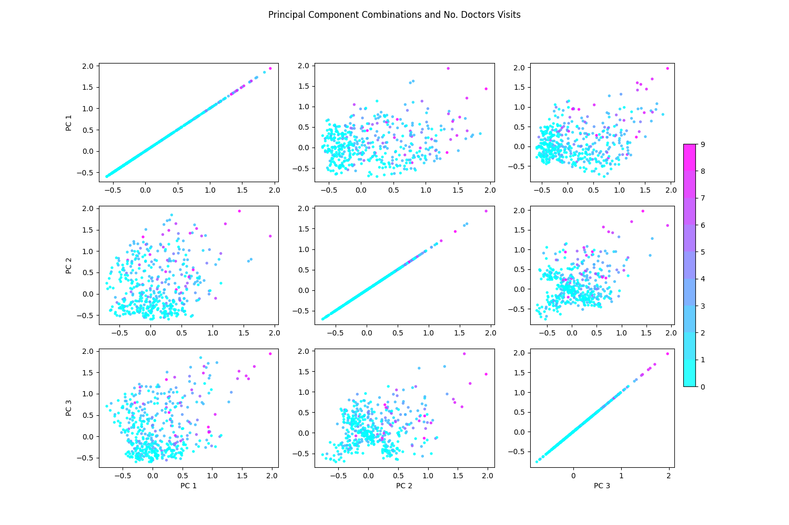
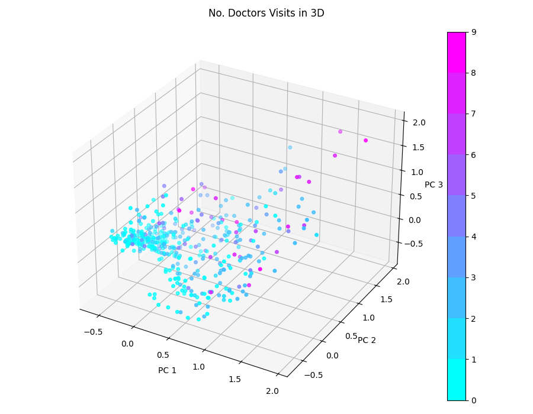
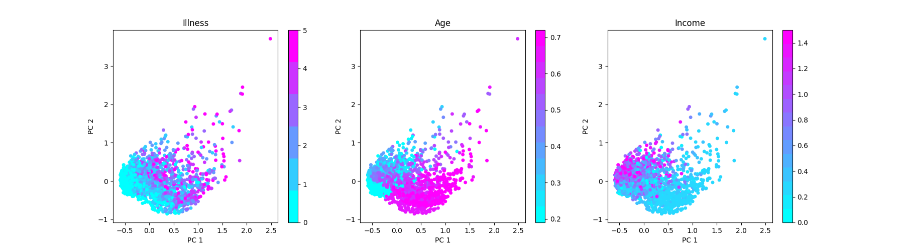
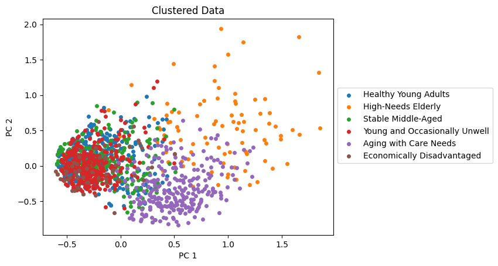

The code for the following segment was done in Python, all code can be
found in the corresponding jupyter notebook.

# Parallel Coordinates Plot
Let's have a look at a parallel coordinates plot and see if
there are any visible patterns in the data. Here I'm ignoring some
columns, as I haven't found them very interesting in this plot.

We can take a closer look at the high values of doctors visits by
selecting just them:

From the plots above we can draw a few conclusions. The most surprising
one for me is that people who visit the doctor a lot are not the same
people who stay in the hospital a lot. It seems that cases with a high
number of doctors visits may have a relatively normal length hospital
stay, after/before which they visit the doctor a lot. Interestingly,
we can also see that a lot of people with a high number of doctors
visits do get admitted to hospital at least once, if not multiple times.

Another observation is that all people with a high number of doctors
visits have been sick at least once in the past 2 weeks. We also dont
see any strong correlation between nondocco and doctorco which is
interesting. Age also doesn't seem to be a huge factor, although there
are more old people going to the doctor.

# Projecting the Data to 2 Dimensions
In order to visualize the dataset with a plot, we need to reduce the
number of dimensions. I'll be using 2 methods for dimensionality
reduction:

**PCA**:
PCA works very well for continuous data, but our dataset is all
categorical variables, making PCA a little out of place.
It should however be interesting to see how it fares.

**MCA**:
MCA is basically PCA but for categorical data. It should work much better
for the categorical variables we have.

For most of my analysis, I will be excluding doctors visits from the
downprojection, and instead encoding it using color. This provides a way
of analyzing how easy it may be to separate out high doctors visits from
the rest of the data.

## Explaining MCA
Since we don't cover MCA in the course, I'll provide a short summary of
how it works here.
MCA stands for "Multiple Correspondence Analysis", and is an extension
of Correspondence Analysis.

The procedure of MCA is as follows:
1. Build an *indicator matrix* (one-hot encoding of the data)
2. Perform CA on the indicator matrix.

### Correspondence Analysis
I'll provide two explanations of how CA works in the context of MCA.
One is the actual regular theory, while the other is based on PCA.
The regular procedure is as follows:

1. Let $N$ be the sum of all entries in our indicator matrix $X$.
2. $Z=\frac{X}{N}$ (We're basically normalizing the data).
3. Let $r$ be a vector containing the sums along the rows of $Z$, and
   let $c$ be the sum along all columns of $Z$.
4. With this, perform the decomposition: $M=diag(r)^{-\frac{1}{2}}(Z-rc^{T})diag(c)^{-\frac{1}{2}}$.
5. This gives you $M=P\Delta Q^{T}$.

### PCA Based Explanation

I'm sure you can see the similarities with PCA in the CA version.
This is the PCA based explanation:

1. Let $y_{ik}$  be a value in the indicator matrix and let $p_{k}$ be
   the sum of row $k$ in the indicator matrix.
2. We normalize the indicator matrix: $x_{ik}=y_{ik}/p_{k} - 1$
3. Apply un-standardized  PCA to this matrix.

Both of these approaches have been proven equivalent.

## Down-projecting with PCA:
Here I simply use normalized PCA on the dataset while excluding doctors
visits.

The results aren't very good-looking, but we can clearly see that points
with high amounts of doctors visits do stand out in some areas. It's
clear however that PCA isn't really meant for categorical data, so let's
try MCA.

## Down-Projecting with MCA
Here I initially don't include doctors visits in the down-projection, but
later I take a more exploratory look at the data where I do include it.
After applying MCA, we can first have a look at the eigenvalues and
explained variance.

| component | eigenvalue | % of variance | % of variance cumulative |
|-----------|------------|---------------|--------------------------|
| 0         | 0.236      | 3.62%         | 3.62%                    |
| 1         | 0.134      | 2.05%         | 5.67%                    |
| 2         | 0.129      | 1.98%         | 7.64%                    |
| 3         | 0.115      | 1.76%         | 9.41%                    |
| 4         | 0.111      | 1.71%         | 11.11%                   |
| 5         | 0.111      | 1.70%         | 12.82%                   |

Looking at the % of variance, this doesn't look overly promising. We
can visualize this better with a graph.

A note on the number of components in the graph, there are many more
components than there are dimensions in the data because when
performing MCA we have to one-hot encode the data, therefore increasing
the number of dimensions.

MCA is clearly able to remove some of the obviously correlated
dimensions such as age/agesq. However, there isn't any real elbow in
the plot. This means that reducing the number of dimensions past the
very correlated ones would lose a significant amount of information.
This is a little disappointing, however, if we were really looking to
reduce the amount of dimensions, we could choose around the 20 mark
where there is a slight bend in the curve.

## Visualizing the Data Using MCA

This already looks a lot better than PCA, although it's difficult to
see exactly what's going on due to the overwhelming number of zero's.
Despite this, we can see that again the points with a high number of
doctors visit's do stand out a little.

### Looking at Different Principal Components
Different PC's capture different elements of the data. We can explore
this by plotting them. Here we'll have a look at all combinations of the
first 3 principal components, which capture about 7.64% percent of the
variance of the data.

#### Under-sampling the Data
In order to aid in visualization, I've under-sampled all data by a
factor of 2, and additionally under-sampled 0's and 1's by a factor of 10.
This makes it much easier to see points with a high number of doctors
visits.

What I find interesting about the plot above is that the best separation
of high numbers of doctors visits (in my opinion) is being done by the
1st and 3rd principal components. This is contrary to the fact that
the 1st and 2nd capture more variance in the data.

### 3D Downprojection
Lastly, we can also look at the projection in 3D space.

In 3D we can clearly see that there do seem to be some clusters in the
data. However, they don't seem to be strictly related to doctors visits.

### Additional Data Exploration
While looking at doctors visits is interesting, I'd also like to look
at some other variables. In the following down-projections I've included
doctors visits in the MCA.
An important note is that I'm no longer under sampling 0's and 1's here.
I'm instead under-sampling the whole dataset by a factor of 2.

The above plot's give some interesting insight into how illness, age
and income are related. We can see that the number of illnesses in the
past 2 weeks is dramatically lower in young people. We can also see that
Income is much lower in older people. This makes sense as they are
probably in retirement and are not being paid a full time wage anymore.
The extreme points that seem like outliers are actually the ones with a
high number of doctors visits.

### Visualizing Higher Dimensional Clusters
The team has looked at clustering in higher dimensions, and this
down-projection gives us an opportunity to visualize these clusters.

Comparing with the previous plot's, it's interesting to be able to
directly see what kind of information these clusters have captured. For
example, the "Aging with Care Needs" cluster is exactly on top of where
the old population is in the dataset.
This makes a lot of sense and may even be obvious, but it's very
interesting to be able to visually see it.

We also see that a few clusters are on top of one another. This
illustrates the fact that our down-projection is inherently losing
information and is called "overcrowding". We knew this was a problem
based off of the explained variance presented earlier.
While these clusters may make sense in higher dimensions where there is
extra variance, they end up overlapping here.

Overcrowding is a common problem with dimensionality reduction, and it
would be interesting to be able to try some different algorithms like
t-SNE or ISOMAP, which take some extra measures over PCA to mitigate this
problem.
