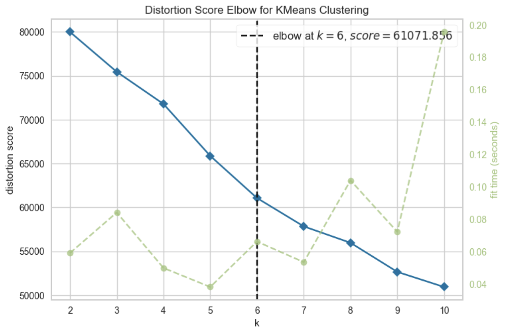
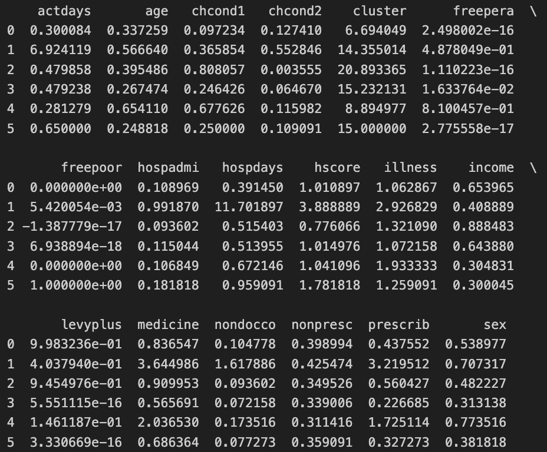
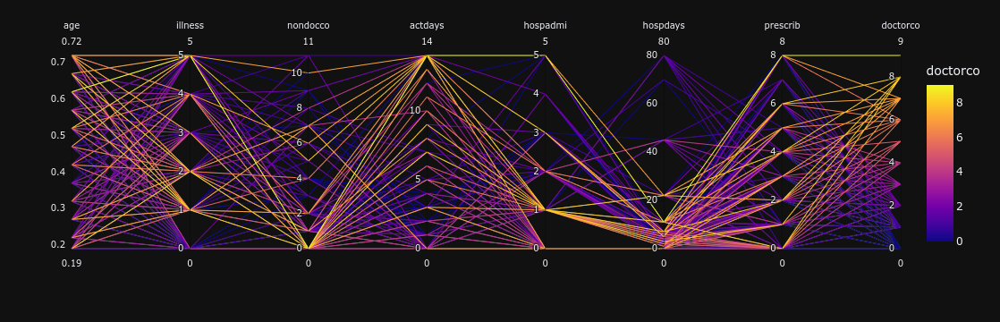
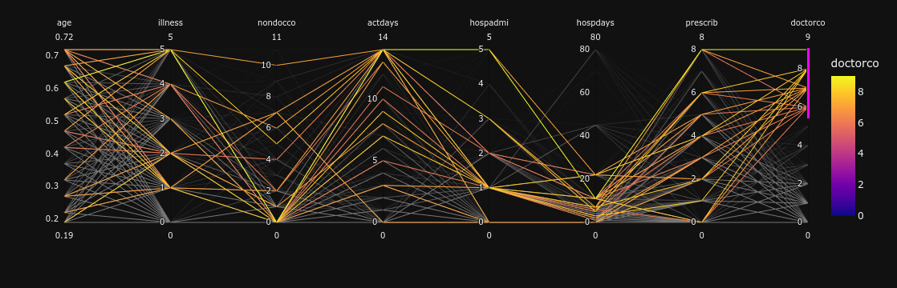
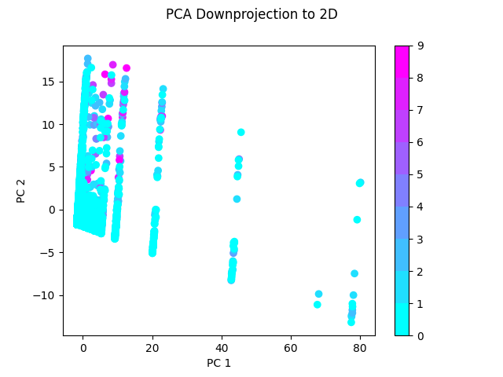
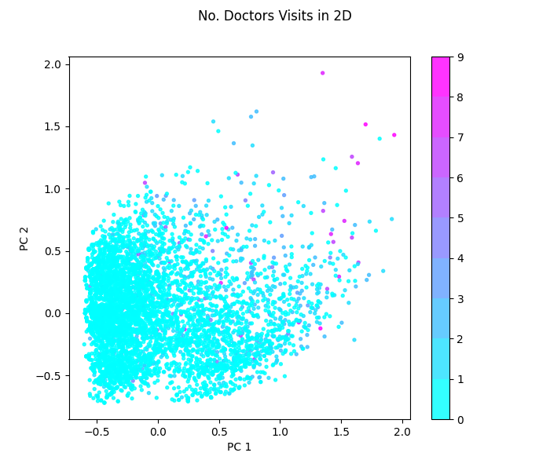
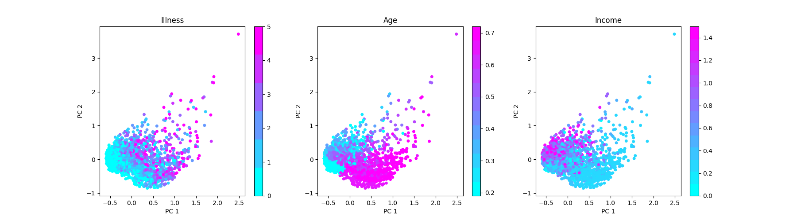
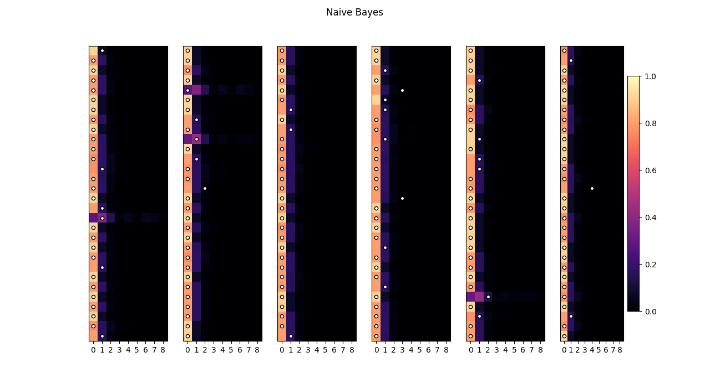

```{r setup, include=FALSE}
knitr::opts_chunk$set(echo = TRUE)

library(readr)
library(Hmisc)
library(ggplot2)
library(dplyr)
library(MASS)
library(corrplot)
library(factoextra)
library(cluster)
library(tidyverse)
```

# ABSTRACT

In this final project for the course "344SM - Statistical Methods" we will analyze the dataset based on the Australian health survey from 1977 to 1978. The dataset contains information of 5190 individuals and 19 variables, including the response variable 'doctorco', which is the number of consulations with a doctor or specialist in the past 2 weeks. 

For the purpose of this project, after the initial data exploration analysis, including the data cleaning and the data visualization, we will focus on the prediction of the number of consulations with a doctor or specialist in the past 2 weeks. We will use:

- Negative Binomial regression 
- Zero-inflated Poisson regression
- Zero-inflated Negative Binomial regression
- Hurdle Poisson regression
- Hurdle Negative Binomial regression
- Logistic regression
- Random Forest 
- Naive Bayes
- Neural Networks 
- K-Nearest Neighbors

The whole project was implemented with two programming languages, R and Python, thereby harnessing the specialized capabilities of each to create a robust, efficient, and versatile analytical workflow. This dual-language approach facilitated the leveraging of R's advanced statistical analysis and visualization tools alongside Python's superior data manipulation, machine learning, and integration capabilities. As a result, the project benefited from the rich and diverse libraries of both ecosystems, ensuring that each stage of the project, from data cleaning to complex statistical modeling and even deployment, was handled with the most effective tools available. This method not only enhanced the overall quality and depth of the analysis but also fostered a flexible and innovative environment for tackling the multifaceted challenges of the project.

##Dataset

The dataset contains information divided into these 19 variables:

* **Categorical (Binary) variables:**
  - 'sex': gender of the individual (1 if female, 0 if male);
  - 'levyplus': 1 if covered by private health insurance fund for private patient in public hospital (with doctor of choice), 0 otherwise;
  - 'freepoor': 1 if covered by government because of low income, recent immigrant, unemployed, 0 otherwise;
  - 'freepera': 1 if covered by government because of old-age or disability pension, or because invalid veteran or family of deceased veteran, 0 otherwise;
  - 'chcond1': 1 if chronic condition(s) but not limited in activity, 0 otherwise;
  - 'chcond2': 1 if chronic condition(s) and limited in activity, 0 otherwise;

* **Categorical (Ordinal) variables:**
  - 'age': age in years divided by 100 (measured as mid-point of the age groups from 15-19 years to 65-69 years with the last group being 70 years and over treated as 72);
  - 'agesq': 'age' squared;
  - 'income': Annual income in Australian dollars divided by 1000 (measured as mid-point of coded ranges Nil, < 200, 200-1000, 1001-, 2001-, 3001-, 4001-, 5001-, 6001-, 7001-, 8001-10000, 10001-12000, 12001-14000, with 14001- treated as 15000);
  - 'hscore': General health questionnaire score using Goldberg's method. High score indicates bad health;

* **Discrete variables:**
  - 'illness': Number of illnesses in the past 2 weeks with 5 or more coded as 5;
  - 'actdays': Number of days in the past 2 weeks with activity limitation due to illness or injury;
  - 'doctorco': (Response variable) Number of consultations with a doctor or specialist in the past 2 weeks;
  - 'nondocco': Number of consultations with non-doctor health professional (chemist, optician, physiotherapist, social worker, district community nurse, chiropodist or chiropractor, etc.) in the past 2 weeks;
  - 'hospadmi': Number of admissions to a hospital, psychiatric hospital, nursing or convalescent home in the past 12 months (up to 5 or more admissions which is coded as 5);
  - 'hospdays': Number of nights in a hospital, etc. during most recent admission: taken, where appropriate, s the mid-point of the intervals 1, 2, 3, 4, 5, 6, 7, 8-14, 15-30, 31-60, 61-79 with 80 or more admissions coded as 80. If no admission in past 12 months the coded as 0;
  - 'medicine': Total number of prescribed and nonprescribed medications used in past 2 weeks;
  - 'prescrib': Number of prescribed medications used in past 2 weeks;
  - 'nonpresc': Number of nonprescribed medications used in past 2 weeks;

**Considerations and before starting the analysis - Levy in Australia health care in 70-80s**

Health care in Australia during 1977-1978 was is a transitional phase, with major focus on a universal health insurance system called Medibank. The Medibank scheme was introduced by the Whitlam Government in 1975 through the Health Insurance Act 1973. The scheme was intended to provide universal health insurance to all Australians and to provide free treatment in public hospitals. The scheme was to be funded by a 2.5% levy on taxable incomes, an additional levy on high-income earners, as well as government funding. The Medibank scheme was later abolished by the Fraser Government in 1981, and replaced by a government-subsidised private insurance scheme, called Medibank Private, which exists to this day. The dataset we are using is from the period when the Medibank scheme was in place, and it is interesting to see how the health care system was functioning at that time.

The Australian health care system has a federal structure, with responsibilities split between federal and state/territory governments. The federal government was primarly responsible for funding and policy, while the state/territory governments were responsible for the delivery of health care services. The cost of running Medibank was a significant concerns for the government during this period. There were debates aboyt whether Medibank provided truly equitable access for all Australians and concerns about longer waiting times in the public system. 


# Explanatory Data Analysis

Despite the oldness of the dataset, it doesn't contain any missing value and the data is clean. Firstly, we will explore the dataset by looking at the distribution of the response variable 'doctorco' and the distribution of the other variables. Then, we will look at the correlation between the variables and the response variable.

For this analysis, we excluded 'agesq' (age squared) from data frame while maintaining 'age' in this analysis to simplify models and make it more interpretable, and avoid potential issues like redundancy and multicollinearity, without significantly compromising the accuracy of analysis.

```{r, echo=FALSE}
df <- read_csv("HealthCareAustralia.csv")

# Exclude 'agesq' and 'constant' columns
df <- df[ , !(names(df) %in% c('agesq', 'constant'))]

df_d <- df[ , !(names(df) %in% c('doctorco'))]

```
## Dataset Analysis

We start to analyse response variable and independent variables. 

### Response variable: 'doctorco'

```{r, echo=TRUE}
describe(df$doctorco)
```

```{r, echo=TRUE}

df %>%
  ggplot(aes(x = doctorco)) +
  geom_histogram(aes(y = after_stat(density)), color = "black", fill = "blue", bins = 20) +
  labs(title = "Distribution of Doctor Consultations",
       x = "Number of Doctor Consultations",
       y = "Density") +
  theme_minimal() +
  theme(panel.grid = element_line(colour = "black"))

# Summary Statistics
summary(df$doctorco)

# Box plot for outlier visualization
df %>%
  ggplot(aes(x = doctorco)) +
  geom_boxplot() +
  theme_minimal()

# Value counts
table(df$doctorco)

```

```{r, echo=TRUE}
# Distribution of 'doctorco' (log scale for better visualization)
df %>%
  ggplot(aes(x = doctorco)) +
  geom_histogram(aes(y = after_stat(count + 1)), color = "black", fill = "blue", bins = 30) +
  labs(title = "Distribution of Doctor Consultations (log scale)",
       x = "Number of Doctor Consultations",
       y = "Count") +
  scale_y_continuous(trans = "log10") +  # Use log scale for y-axis
  theme_minimal() +
  theme(panel.grid = element_line(colour = "black"))

# Summary Statistics
print(summary(df$doctorco))

# Value counts
print(table(df$doctorco))


```

The variable 'doctorco' (doctor consultations) is the response variable in the dataset, reflecting the number of consultations with a doctor or specialist in the past 2 weeks. The distribution is highly skewed to the right, with the majority of individuals (79.8%) reporting zero consultations. This indicates a low overall rate of doctor consultations within the given timeframe. A small proportion of individuals have one or more consultations, but these are much less common.

The plots provided likely include a histogram showing the frequency distribution of consultations, a density plot highlighting the probability density of the different consultation counts, and a log-transformed histogram to better visualize the distribution of the non-zero consultation counts. The log scale is useful for distributions like this where there's a large concentration of zero values and a long tail for higher values.

The first histogram shows a very high bar at 0 consultations, which greatly surpasses the frequency of any other number of consultations. This reflects the skewness towards lower numbers of doctor visits within the two-week period.

The second plot, likely a rug plot or a variation thereof, indicates the individual data points along the axis, emphasizing the concentration at 0 consultations and the sparsity of data points as the number of consultations increases.

The third histogram, presented on a log scale, adjusts the y-axis to better display the distribution of counts above 0. The height of the bars for counts of 1 or more consultations is more discernible on this scale, highlighting the long-tail nature of the distribution. 

The distribution and mean of this variable are critical for healthcare planning and resource allocation, as they provide insight into the utilization of medical professional services.


### Variables

```{r, echo=FALSE}
# libraries
library(ggplot2)
library(gridExtra)
library(rlang)

# Create two lists to store plots
plot_list1 <- list()
plot_list2 <- list()

# Determine the midpoint of the remaining columns
midpoint <- ceiling(ncol(df_d) / 2)

# Loop through the first half of the columns in the dataframe
for(i in 1:midpoint) {
  # Create a histogram for each column and store it in the first list
  p <- ggplot(df_d, aes(!!sym(names(df_d)[i]))) + geom_histogram(bins = 50) + theme_minimal()
  plot_list1[[i]] <- p
}

# Loop through the second half of the columns in the dataframe
for(i in (midpoint+1):ncol(df_d)) {
  # Create a histogram for each column and store it in the second list
  p <- ggplot(df_d, aes(!!sym(names(df_d)[i]))) + geom_histogram(bins = 50) + theme_minimal()
  plot_list2[[i-midpoint]] <- p
}
```

**Principal statistics:**

```{r, echo=TRUE}
##describe(df_d)

```

```{r, echo=TRUE}
summary(df_d)
```

**Plots:**

```{r, echo=TRUE}
# Arrange the plots in the first list in a grid
do.call(grid.arrange, plot_list1)

# Arrange the plots in the second list in a grid
do.call(grid.arrange, plot_list2)

```

- Starting with the variable 'sex', the histogram would typically display two bars reflecting the count of each gender category in the dataset, with 0 representing male and 1 representing female participants. The statistical summary indicates a slight majority of females over males, as evidenced by the mean of 0.52, wich suggests that approximately 52% of individuals are female.
- The 'age' variable is normalized by dividing by 100, thus the range in the dataset is from 0.19 (representing 15-19 years old) to 0.72 (representing 72 years or older). The median age is 0.32 and the mean age is slightly higher at 0.40, suggesting a distribution that is slightly skewed towards older individuals. The histogram's shape would likely show a decline in frequency as age increases, which is typical for a population with fewer older individuals.
- The variable 'income' represent annual income in Australian dollars, divided by 1000 and coded into ranges. The highest frequency is observed in values 0.25. This data provides insights into the economic diversity and distribution within the sample population.
- The variable 'levyplus' indicate whether individuals are covered by a private health insurance fund for a private patient in a public hospital. The total sum of '1's in the dataset is 2,298, which means that 2298 individuals out of the 5190 have this specific type of private health insurance coverage.
- The variable 'freepoor' is another binary categorical variable and it indicates whether individuals are covered by government healthcare due to low income, recent immigration status, or unemployment. The total sum of 1's is 222, which suggests that 222 individuals out of the total 5190 (approximately 4.2%) in the dataset are covered by the government for the reasons mentioned. 
- The variable 'freepera', binary categoricak variable, that indicates whether individuals are covered by the government for health care due to old-age or disability pension, or because they are invalid veterans or family members of deceased veterans. Out of the total dataset, 1,091 individuals are indicated as covered under this category, as shown by the sum of '1's (approximately 21.02%). 
- The variable 'illness' is a discrete variable that represents the number of illnesses an individual had in the past two weeks. The mean number of illnesses reported is 1.432, indicating that on average, individuals reported having about one to two illnesses in the past two weeks. The distribution of this variable shows the most common values are 0 and 1, with 1,554 and 1,638 occurrences respectively, suggesting a significant portion of the population either had no illness or just one illness in the past two weeks. The number of reported illnesses decreases as the count increases, with the least common being 5 illnesses, reported by 236 individuals.
- The variable 'actdays' represents the number of days of reduced activity in the past two weeks due to illness or injury. The mean of 0.86 indicates the average number of days of reduced activity, suggesting that, on average, individuals experienced less than one day of reduced activity. In fact, most of the individuals (85.8%) reported no days of reduced activity, with the highest frequency (3.6%) observed for 14 days (the maximum value reported), so right skewed distributed. 
- the variable 'hscore' is a measure of general health status using Goldberg's method, where a higher score indicates poorer health. The mean score is 1.218, suggesting a moderately low average health score in the population, indicating generally good health.Most individuals (58.3%) have a score of 0, indicating no health issues according to the questionnaire. The distribution is right skewed. 
- The variable 'chcond1' indicates the presence of chronic conditions without limiting activity. The mean of 0.4031 indicates that approximately 40.31% of individuals have a chronic condition without activity limitation.
- The variable 'chcond2' is a binary categorical variable that indicates the presence of chronic conditions with activity limitation. The total sum of '1's in the dataset is 605, meaning that 605 individuals reported having chronic conditions that limit their activity.The mean of 0.1166 shows that about 11.66% of the dataset's individuals have chronic conditions that limit their activities.
- The variable 'nondocco' measures the number of consultations with non-doctor health professionals. The mean of 0.2146 suggests that, on average, there are very few consultations with non-doctor health professionals.The data is heavily skewed towards 0, with 90.9% of the sample reporting no consultations, and very few individuals reporting more than one consultation.
- The variable 'hospadmi' represents the number of hospital admissions within the past 12 months. The majority of individuals (86.5%) reported no hospital admissions in the past year. A smaller proportion, 10.8%, had one hospital admission, and even fewer had two or more admissions.
- The variable 'hospdays' reflects the number of nights spent in a hospital or similar institution during the most recent admission. A significant majority of individuals (86.5%) reported no nights spent in a hospital in the past 12 months.
Smaller proportions reported staying 1 to 80 nights, with the highest frequencies observed for shorter stays (1 to 2 nights).
- The variable 'medicine' quantifies the total number of prescribed and nonprescribed medications used in the past two days. A significant proportion of individuals (42.9%) reported not using any medication in the past two days. The frequencies gradually decrease as the number of medications increases, with 26.8% using one medication and smaller proportions using two or more. The mean of 1.218 indicates that on average, individuals used just over one medication in the past two days.
- The variable 'prescrib' refers to the total number of prescribed medications used in the past 2 days ranging from 0 to 8. A significant proportion of the dataset, 59.4%, reported not using any prescribed medication in the past 2 days.
The frequency decreases as the number of medications increases, with fewer individuals reporting the use of a higher number of prescribed medications. The mean of 0.8626 indicates that, on average, individuals used less than one prescribed medication in the past 2 days.
- The variable nonpresc represents the total number of nonprescribed medications used in the past 2 days ranging from 0 to 8 (like 'prescrib'). A large majority of the dataset, 73.5%, reported not using any nonprescribed medication in the past 2 days. A notable proportion (20.3%) reported using one nonprescribed medication. The frequency decreases significantly with an increase in the number of nonprescribed medications used. The mean of 0.3557 suggests that, on average, individuals used around one third of a nonprescribed medication in the past 2 days.


### Considerations

The analysis of the variables and the response variable 'doctorco' in the dataset has revealed some key points:

The data provides a comprehensive view of healthcare utilization, with a range of variables from health status to service usage. The binary variables (like sex, levyplus, freepoor and chcond1/2) allow for clear distinctions in the population and are easy to model. The other dicrete variables like illness and actdays capture count data which can be informative for healthcare demand modelling. Also the response variable's distribution is quite clear, showing a majority of individuals not consulting a doctor, which may reflect real-world scenarios and, for example, support planning and policy development.

But, there are also negative points on it:

The right-skewed distribution of 'doctorco' suggests that most of the data points are zeros, which could lead to zero-inflation issues in modelling. Also the use of discretized continuous variables like age and income may lose some information compared to truly continuous measurements. Then, the presence of long-tail distributions in variables like hospdays and medicine may require specific transformation or specific modelling techniques like Poisson or negative binomial regression to handle overdispersion. Binary and discrete variables with limited variance might not contribute as much to a predictive model's complexity or accuracy. 

In order to produce a good report, it was necessary to pay close attention to the use of variables and their modelling. The dataset is a typical use case of real data, which one may come across every day. The analysis, in all its steps, is of fundamental importance to fully understand the application context. 

We can say also that other variables could be included in the analysis, such as the use of other types of health services, the use of emergency services, the use of preventive health services, among others. The inclusion of these variables could provide a more comprehensive view of the use of health services and the factors that influence this use. For example, if we mind about people who had ictus, heart attack, diabetes, among others, and how these diseases influence the use of health services. In that case, the doctor consultation in the last year could be more influenced by the presence of these diseases. In fact, not all diseases are the same, and some diseases require more frequent consultations than others, but only in rare cases individuals got specific consultations for these diseases in the last 2 weeks. Same things for the use of emergency services, preventive health services, and other types of health services, or individuals who had broken bones, or other types of accidents. In that case, is not required to have doctor consultations in the range 2 weeks, maybe the consultations are required every 3 weeks, or every month. 

Furthermore, both R and Python were used to perform the analysis and the results were consistent. The use of both languages was important in order to show the flexibility of the analysis and the importance of the use of both languages in data analysis. Again, the use and combinations of these different methods generally reflect the know-how of the contributors to this analysis project.


## Bivariate Analysis: 'doctorco' vs other variables

## Correlation Matrix

This is the Correlation Matrix:

```{r, echo=TRUE}
# Calculate the correlation matrix
correlation_matrix <- cor(df, method = "pearson")
#correlation_matrix

corrplot(correlation_matrix, method = "square",
         diag = TRUE)
```

From a visually interpretation of the correlation matrix:

**Key Findings:**

- Healthcare Utilization: Older individuals with more illnesses, hospitalizations, and medication use tend to have more frequent doctor consultations. This highlights the increased healthcare needs associated with age and health conditions.

- Income Disparity and Healthcare: Individuals with lower income see doctors less frequently, even in the presence of health problems. This suggests potential barriers to healthcare access for lower-income populations.

- Illness, Hospitalization, and Length of Stay: Older individuals with more health issues and frequent hospitalizations tend to have longer hospital stays. This points to the complexity of managing complex health conditions.

- Medication Use: Unsurprisingly, those with more health issues, doctor visits, and hospitalizations receive more prescriptions. This underscores the role of medications in managing multiple health conditions.

- Non-Prescribed Medication Use: Older individuals with more health problems and doctor consultations also use over-the-counter or non-prescribed medications more frequently.

**Important Reminders:**

- Correlation vs. Causation: The findings highlight associations, not direct cause-and-effect relationships. Other factors could be influencing these patterns.

- Addressing Healthcare Disparities: The income-related findings warrant further investigation into potential socioeconomic barriers that can limit access to care for lower-income individuals.

### 'doctorco' vs. 'sex'

Starting this bivariate analysis with variable 'sex':

```{r, echo=TRUE}
describe(df$sex)
```

```{r, echo=TRUE}
# value counts
df %>% count(sex)

# plot of sex
ggplot(df, aes(x=sex)) +
  geom_histogram(position="dodge", bins=30) +
  ggtitle("Sex") +
  theme_minimal()
```

```{r, echo=TRUE}
# Create a cross-tabulation
sex_doctorco_table <- table(df$sex, df$doctorco)

# Chi-square test of independence
chisq.test(sex_doctorco_table)

# It could also fit a model like a negative binomial if doctor consultations are overdispersed

nb_model <- glm.nb(doctorco ~ sex, data = df)
summary(nb_model)

# For visualization
ggplot(df, aes(x = sex, fill = factor(doctorco))) + 
  scale_y_continuous(trans = "log10") +
  ggtitle("'doctorco' by sex (log scale)") +
  geom_bar(position = "dodge", stat = "count")


```

From this analysis, the Chi-squared test result (p-value = 3.188e-12) suggests a strong association between sex and the number of doctor consultations. This means that the frequency of doctor consultations is not independent of the sex of the individual. The negative binomial regression results indicate a significant relationship between sex and doctor consultations. The coefficient for 'sex' (0.42627) is positive and significant (p < 1e-9), which suggests that one sex (typically coded as 1) has a higher rate of doctor consultations than the other (typically coded as 0), when all other factors are held constant. From the plot, The y-axis is on a logarithmic scale, which helps to display a wide range of values for count data where some counts (like 0) are much more frequent than others. There is a visible difference in the distribution of the number of doctor consultations between the two sexes. This is consistent with the results from the negative binomial regression.


### 'doctorco' vs. 'age'

Bivariate analysis with variable 'age':

```{r, echo=TRUE}
describe(df$age)
```

```{r, echo=TRUE}
# value counts
df %>% count(age)

# plot of age
ggplot(df, aes(x=age)) +
  geom_histogram(position="dodge", bins=30) +
  ggtitle("Age") +
  theme_minimal()
```


```{r, echo=TRUE}
# Create a cross-tabulation
age_doctorco_table <- table(df$age, df$doctorco)

# Chi-square test of independence
chisq.test(age_doctorco_table)

# It could also fit a model like a negative binomial if doctor consultations are overdispersed

nb_model <- glm.nb(doctorco ~ age, data = df)
summary(nb_model)

# For visualization
ggplot(df, aes(x = age, fill = factor(doctorco))) + 
  #scale_y_continuous(trans = "log10") +
  geom_bar(position = "dodge", stat = "count")

```

Applied Negative Binomial regression to study the interaction between response variable and 'age'. The regression output suggests that age is a strong predictor of the number of doctor consultations. There is a significant positive relationship, meaning that as the age category increases, the expected number of doctor consultations also increases. This could be due to various factors like higher health issues with increasing age or greater health awareness.

To better analyze the variable 'age', we grouped it 3 categories: 15-19, 20-50 and greater than 51. 

```{r, echo=TRUE}
# First, create a new factor variable for age groups
df$age_group <- cut(df$age,
                    breaks = c(-Inf, 0.19, 0.50, 0.72),
                    labels = c("0-19", "20-50", "51-100"),
                    right = TRUE) # This includes the right endpoint in the interval

# Convert to a factor to ensure proper ordering in plots and models
df$age_group <- factor(df$age_group, levels = c("0-19", "20-50", "51-100"))


# Create a cross-tabulation table for the new age_group variable and 'doctorco'
age_group_doctorco_table <- table(df$age_group, df$doctorco)

# Chi-squared test
chisq_results <- chisq.test(age_group_doctorco_table)

# Negative binomial regression
nb_model <- glm.nb(doctorco ~ age_group, data = df)
nb_model_summary <- summary(nb_model)

# Plot the count of doctor consultations by new age_group
ggplot(df, aes(x = age_group, fill = factor(doctorco))) + 
  geom_bar(position = "dodge", stat = "count") +
  scale_y_continuous(trans = "log10") +
  labs(x = "Age Group", y = "Count of Doctor Consultations (log scale)", title = "Doctor Consultations by Age Group") +
  theme_minimal()

# Display results
print(chisq_results)
print(nb_model_summary)


```

The theta value of the negative binomial distribution (0.4156) indicates overdispersion in the count data, which justifies the use of the negative binomial model over simpler Poisson regression. The analysis demonstrates that age is a predictor of the number of doctor consultations, with the "51-100" age group showing a significantly higher frequency of consultations compared to the "0-19" age group. This suggests that older individuals are more likely to have a higher number of doctor consultations. The "20-50" age group does not show a significant difference from the "0-19" age group in terms of the number of doctor consultations. Then, we provided different solutions on categorization of 'age' variable.


### 'doctorco' vs. 'income'

Bivariate analysis with variable 'income':

```{r, echo=TRUE}
describe(df$income)
```

```{r, echo=TRUE}
# value counts
df %>% count(income)

# plot of age
ggplot(df, aes(x=income)) +
  geom_histogram(position="dodge", bins=40) +
  ggtitle("Annual Income (divided by 1000)") +
  theme_minimal()
```


```{r, echo=TRUE}
# Create a cross-tabulation
income_doctorco_table <- table(df$income, df$doctorco)

# Chi-square test of independence
chisq.test(income_doctorco_table)

# It could also fit a model like a negative binomial if doctor consultations are overdispersed

nb_model <- glm.nb(doctorco ~ income, data = df)
summary(nb_model)

# For visualization
ggplot(df, aes(x = income, fill = factor(doctorco))) + 
  scale_y_continuous(trans = "log10") +
  geom_bar(position = "dodge", stat = "count")

```

The analysis indicates that there is a significant negative relationship between income and the number of doctor consultations. Individuals with higher incomes tend to have fewer doctor consultations. This could be attributed to various factors, including but not limited to, better overall health, access to preventive care, or different health service utilization patterns among higher-income individuals.

For a better visualization and extra analysis of the variable, looking at the summary of 'income', the 25th, 50th (median), and 75th percentiles are given as 0.25, 0.55, and 0.90 (times 1000), respectively. These values can serve as natural dividing points for categories:
- Low Income: Less than or equal to 0.25 (≤ \$250)
- Middle Income: Greater than 0.25 but less than or equal to 0.90 (>\$250 and ≤ \$900)
- High Income: Greater than 0.90 (>\$900)

```{r, echo=TRUE}
df <- df %>%
  mutate(income_group = case_when(
    income <= 0.25 ~ "Low",
    income > 0.25 & income <= 0.90 ~ "Middle",
    income > 0.90 ~ "High"
  ))

df$income_group <- factor(df$income_group, levels = c("Low", "Middle", "High"))

# Create a cross-tabulation table for the new age_group variable and 'doctorco'
income_group_doctorco_table <- table(df$income_group, df$doctorco)

# Chi-squared test
chisq_results <- chisq.test(income_group_doctorco_table)

# Negative binomial regression
nb_model <- glm.nb(doctorco ~ income_group, data = df)
nb_model_summary <- summary(nb_model)

# Plot the count of doctor consultations by new age_group
ggplot(df, aes(x = income_group, fill = factor(doctorco))) + 
  geom_bar(position = "dodge", stat = "count") +
  scale_y_continuous(trans = "log10") +
  labs(x = "Income Group", y = "Count of Doctor Consultations (log scale)", title = "Doctor Consultations by Income Group") +
  theme_minimal()

# Display results
print(chisq_results)
print(nb_model_summary)


```

As stated before, the analysis and visualization provide evidence that income level is inversely associated with the number of doctor consultations. Individuals in lower income groups tend to consult doctors more frequently than those in higher income groups. This could reflect differences in health status, access to preventive care, or health service utilization patterns among income groups. 


### 'doctorco' vs. 'levyplus'

Bivariate analysis with variable 'levyplus':

```{r, echo=TRUE}
describe(df$levyplus)
```

```{r, echo=TRUE}
# value counts
df %>% count(levyplus)

# plot of levyplus
ggplot(df, aes(x=levyplus)) +
  geom_histogram(position="dodge", bins=40) +
  ggtitle("levyplus") +
  theme_minimal()
```

```{r, echo=TRUE}
# Create a cross-tabulation
levyplus_doctorco_table <- table(df$levyplus, df$doctorco)

# Chi-square test of independence
chisq.test(levyplus_doctorco_table)

# It could also fit a model like a negative binomial if doctor consultations are overdispersed

nb_model <- glm.nb(doctorco ~ levyplus, data = df)
summary(nb_model)

# For visualization
ggplot(df, aes(x = levyplus, fill = factor(doctorco))) + 
  scale_y_continuous(trans = "log10") +
  ggtitle("'doctorco' by levyplus (log scale)") +
  geom_bar(position = "dodge", stat = "count")


```

From Negative Binomial regression, the coefficient for 'levyplus' (-0.04252) is not statistically significant (p = 0.534), suggesting that having a private levy does not have a statistically significant effect on the number of doctor consultations.
The analysis suggests that the presence or absence of a private levy does not significantly impact the frequency of doctor consultations. This could mean that other factors, such as the severity of health issues, access to public healthcare, or personal preferences, might play a more significant role in determining how often individuals seek medical advice.


### 'doctorco' vs. 'freepoor'

Bivariate analysis with variable 'freepoor':

```{r, echo=TRUE}
describe(df$freepoor)
```

```{r, echo=TRUE}
# value counts
df %>% count(freepoor)

# plot of freepoor
ggplot(df, aes(x=freepoor)) +
  geom_histogram(position="dodge", bins=40) +
  ggtitle("freepoor") +
  theme_minimal()
```

```{r, echo=TRUE}
# Create a cross-tabulation
freepoor_doctorco_table <- table(df$freepoor, df$doctorco)

# Chi-square test of independence
chisq.test(freepoor_doctorco_table)

# It could also fit a model like a negative binomial if doctor consultations are overdispersed

nb_model <- glm.nb(doctorco ~ freepoor, data = df)
summary(nb_model)

# For visualization
ggplot(df, aes(x = freepoor, fill = factor(doctorco))) + 
  scale_y_continuous(trans = "log10") +
  ggtitle("'doctorco' by 'freepoor' (log scale)") +
  geom_bar(position = "dodge", stat = "count")


```

Given the context that the 'freepoor' binary variable indicates government coverage for individuals who may have low income, are recent immigrants, or are unemployed, and that only 222 out of 5190 individuals in the dataset are covered by the government, the graph and statistical output together suggest that among the individuals in the dataset, those who are covered by the government due to their socioeconomic status tend to use fewer doctor consultations. This could be a positive indicator of the effectiveness of the coverage or, conversely, a sign that there are still unmet healthcare needs or barriers within this group.


### 'doctorco' vs. 'freepera'

Bivariate analysis with variable 'freepera':

```{r, echo=TRUE}
describe(df$freepera)
```

```{r, echo=TRUE}
# value counts
df %>% count(freepera)

# plot of freepera
ggplot(df, aes(x=freepera)) +
  geom_histogram(position="dodge", bins=40) +
  ggtitle("freepera") +
  theme_minimal()
```

```{r, echo=TRUE}
# Create a cross-tabulation
freepera_doctorco_table <- table(df$freepera, df$doctorco)

# Chi-square test of independence
chisq.test(freepera_doctorco_table)

# It could also fit a model like a negative binomial if doctor consultations are overdispersed

nb_model <- glm.nb(doctorco ~ freepera, data = df)
summary(nb_model)

# For visualization
ggplot(df, aes(x = freepera, fill = factor(doctorco))) + 
  scale_y_continuous(trans = "log10") +
  ggtitle("'doctorco' by 'freepera' (log scale)") +
  geom_bar(position = "dodge", stat = "count")


```

the analysis for the binary variable 'freepera', which represents government health coverage due to old-age or disability pension, status as invalid veterans, or as family members of deceased veterans. Out of 5190 individuals in the dataset, 1091 are covered by the government under these criteria. The plot shows that individuals covered by 'freepera' tend to have more doctor consultations across all frequencies than those not covered when viewed on a logarithmic scale. This could indicate that individuals who are older, disabled, or associated with veterans may have more health concerns or a greater need for medical services. The analysis suggests that 'freepera' coverage is linked with increased utilization of healthcare services, as indicated by a higher number of doctor consultations. This could reflect higher healthcare needs or more robust access to healthcare services among the covered group. 


### 'doctorco' vs. 'illness'

Bivariate analysis with variable 'illness':

```{r, echo=TRUE}
describe(df$illness)
```

```{r, echo=TRUE}
# value counts
df %>% count(illness)

# plot of illness
ggplot(df, aes(x=illness)) +
  geom_histogram(position="dodge", bins=40) +
  ggtitle("Illness") +
  theme_minimal()
```


```{r, echo=TRUE}
# Create a cross-tabulation
illness_doctorco_table <- table(df$illness, df$doctorco)

# Chi-square test of independence
chisq.test(illness_doctorco_table)

# It could also fit a model like a negative binomial if doctor consultations are overdispersed

nb_model <- glm.nb(doctorco ~ illness, data = df)
summary(nb_model)

# For visualization
ggplot(df, aes(x = illness, fill = factor(doctorco))) + 
  scale_y_continuous(trans = "log10") +
  ggtitle("'doctorco' by 'illness' (log scale)") +
  geom_bar(position = "dodge", stat = "count")

```

The plot demonstrates that as the number of illnesses increases, there is a corresponding increase in the count of doctor consultations across all frequencies. This suggests that individuals with more health issues are more likely to seek medical advice. The analysis strongly suggests that there is a direct relationship between the burden of illness and healthcare utilization, as measured by the number of doctor consultations. This is in line with expectations, as individuals with a greater number of health complaints are likely to require more medical attention.

### 'doctorco' vs. 'actdays'

Bivariate analysis with variable 'actdays':

```{r, echo=TRUE}
describe(df$actdays)
```

```{r, echo=TRUE}
# value counts
df %>% count(actdays)

# plot of age
ggplot(df, aes(x=actdays)) +
  geom_histogram(position="dodge", bins=40) +
  ggtitle("actdays") +
  theme_minimal()
```

```{r, echo=TRUE}
# Create a cross-tabulation
actdays_doctorco_table <- table(df$actdays, df$doctorco)

# Chi-square test of independence
chisq.test(actdays_doctorco_table)

# It could also fit a model like a negative binomial if doctor consultations are overdispersed

nb_model <- glm.nb(doctorco ~ actdays, data = df)
summary(nb_model)

# For visualization
ggplot(df, aes(x = actdays, fill = factor(doctorco))) + 
  scale_y_continuous(trans = "log10") +
  ggtitle("'doctorco' by 'actdays' (log scale)") +
  geom_bar(position = "dodge", stat = "count")

```

The plot shows that individuals with more days of reduced activity have a higher frequency of doctor consultations across all consultation counts. This trend is consistent with the expectation that individuals who have been more significantly affected by illness or injury would require more medical attention. The analysis indicates a direct and significant relationship between the burden of reduced activity due to illness or injury and the utilization of healthcare services. This is a logical outcome, as one would expect that the more an illness or injury impacts daily activities, the more likely an individual is to seek medical advice.

### 'doctorco' vs. 'hscore'

Bivariate analysis with variable 'hscore':

```{r, echo=TRUE}
describe(df$hscore)
```

```{r, echo=TRUE}
# value counts
df %>% count(hscore)

# plot of age
ggplot(df, aes(x=hscore)) +
  geom_histogram(position="dodge", bins=40) +
  ggtitle("hscore") +
  theme_minimal()
```

```{r, echo=TRUE}
# Create a cross-tabulation
hscore_doctorco_table <- table(df$hscore, df$doctorco)

# Chi-square test of independence
chisq.test(hscore_doctorco_table)

# It could also fit a model like a negative binomial if doctor consultations are overdispersed

nb_model <- glm.nb(doctorco ~ hscore, data = df)
summary(nb_model)

# For visualization
ggplot(df, aes(x = hscore, fill = factor(doctorco))) + 
  scale_y_continuous(trans = "log10") +
  ggtitle("'doctorco' by 'hscore' (log scale)") +
  geom_bar(position = "dodge", stat = "count")

```

The plot shows that as the health score increases, there is a corresponding increase in the count of doctor consultations across all frequencies. This suggests that individuals with higher health questionnaire scores, indicating poorer health, are more likely to seek medical advice. The analysis confirms a direct and significant relationship between the health status as measured by the 'hscore' and healthcare utilization. This is consistent with the expectation that individuals who report worse health would require more medical attention.

### 'doctorco' vs. 'chcond1'

Bivariate analysis with variable 'chcond1':

```{r, echo=TRUE}
describe(df$chcond1)
```

```{r, echo=TRUE}
# value counts
df %>% count(chcond1)

# plot of chcond1
ggplot(df, aes(x=chcond1)) +
  geom_histogram(position="dodge", bins=40) +
  ggtitle("chcond1") +
  theme_minimal()
```

```{r, echo=TRUE}
# Create a cross-tabulation
chcond1_doctorco_table <- table(df$chcond1, df$doctorco)

# Chi-square test of independence
chisq.test(chcond1_doctorco_table)

# It could also fit a model like a negative binomial if doctor consultations are overdispersed

nb_model <- glm.nb(doctorco ~ chcond1, data = df)
summary(nb_model)

# For visualization
ggplot(df, aes(x = chcond1, fill = factor(doctorco))) + 
  scale_y_continuous(trans = "log10") +
  ggtitle("'doctorco' by 'chcond1' (log scale)") +
  geom_bar(position = "dodge", stat = "count")


```

The positive coefficient for 'chcond1' (0.23908 with p = 0.000463) suggests that individuals with chronic conditions have a higher expected count of doctor consultations than those without, even if these conditions do not limit their activity. The plot shows that individuals with chronic conditions that do not limit activity still tend to have more doctor consultations across most frequencies compared to those without chronic conditions. This suggests that while these conditions may not limit daily activities, they still require medical attention. The analysis indicates a significant relationship between the presence of non-limiting chronic conditions and healthcare utilization, as measured by the number of doctor consultations. This suggests that even when chronic conditions do not directly limit activity, they still pose health management needs that lead to increased engagement with healthcare services.

### 'doctorco' vs. 'chcond2'

Bivariate analysis with variable 'chcond2':

```{r, echo=TRUE}
describe(df$chcond2)
```

```{r, echo=TRUE}
# value counts
df %>% count(chcond2)

# plot of chcond2
ggplot(df, aes(x=chcond2)) +
  geom_histogram(position="dodge", bins=40) +
  ggtitle("chcond2") +
  theme_minimal()
```

```{r, echo=TRUE}
# Create a cross-tabulation
chcond2_doctorco_table <- table(df$chcond2, df$doctorco)

# Chi-square test of independence
chisq.test(chcond2_doctorco_table)

# It could also fit a model like a negative binomial if doctor consultations are overdispersed

nb_model <- glm.nb(doctorco ~ chcond2, data = df)
summary(nb_model)

# For visualization
ggplot(df, aes(x = chcond2, fill = factor(doctorco))) + 
  scale_y_continuous(trans = "log10") +
  ggtitle("'doctorco' by 'chcond2' (log scale)") +
  geom_bar(position = "dodge", stat = "count")


```

The positive coefficient for 'chcond2' (0.83430 with p < 2e-16) indicates that individuals with chronic conditions that limit their activity have a higher expected count of doctor consultations compared to those without such conditions. The plot demonstrates that individuals with chronic conditions that limit their activity have more doctor consultations across all frequencies compared to those without such conditions. This is evidenced by the higher bars for '1' on the 'chcond2' scale. The analysis indicates a significant relationship between having limiting chronic conditions and increased healthcare utilization. Individuals with chronic conditions that impact their daily activities are likely to require more medical attention, as reflected in the number of doctor consultations.

### 'doctorco' vs. 'nondocco'

Bivariate analysis with variable 'nondocco':

```{r, echo=TRUE}
describe(df$nondocco)
```

```{r, echo=TRUE}
# value counts
df %>% count(nondocco)

# plot of nondocco
ggplot(df, aes(x=nondocco)) +
  geom_histogram(position="dodge", bins=40) +
  ggtitle("nondocco") +
  theme_minimal()
```

```{r, echo=TRUE}
# Create a cross-tabulation
nondocco_doctorco_table <- table(df$nondocco, df$doctorco)

# Chi-square test of independence
chisq.test(nondocco_doctorco_table)

# It could also fit a model like a negative binomial if doctor consultations are overdispersed

nb_model <- glm.nb(doctorco ~ nondocco, data = df)
summary(nb_model)

# For visualization
ggplot(df, aes(x = nondocco, fill = factor(doctorco))) + 
  scale_y_continuous(trans = "log10") +
  ggtitle("'doctorco' by 'nondocco' (log scale)") +
  geom_bar(position = "dodge", stat = "count")

```

The plot shows that individuals with a higher number of non-doctor health professional consultations tend to have a higher frequency of doctor consultations. This pattern is visible across the logarithmic scale, indicating that engagements with various health professionals are associated with increased doctor visits. The analysis suggests that individuals who consult non-doctor health professionals also tend to have more doctor consultations. This could be due to a variety of reasons, such as the complexity of their health needs, which require multidisciplinary care involving different health professionals, or it could be an indicator of a more proactive approach to health management among these individuals.


### 'doctorco' vs. 'hospadmi'

Bivariate analysis with variable 'hospadmi':

```{r, echo=TRUE}
describe(df$hospadmi)
```

```{r, echo=TRUE}
# value counts
df %>% count(hospadmi)

# plot of hospadmi
ggplot(df, aes(x=hospadmi)) +
  geom_histogram(position="dodge", bins=40) +
  ggtitle("hospadmi") +
  theme_minimal()
```

```{r, echo=TRUE}
# Create a cross-tabulation
hospadmi_doctorco_table <- table(df$hospadmi, df$doctorco)

# Chi-square test of independence
chisq.test(hospadmi_doctorco_table)

# It could also fit a model like a negative binomial if doctor consultations are overdispersed

nb_model <- glm.nb(doctorco ~ hospadmi, data = df)
summary(nb_model)

# For visualization
ggplot(df, aes(x = hospadmi, fill = factor(doctorco))) + 
  scale_y_continuous(trans = "log10") +
  ggtitle("'doctorco' by 'hospadmi' (log scale)") +
  geom_bar(position = "dodge", stat = "count")

```

The positive coefficient for 'hospadmi' (0.70440 with p < 2e-16) indicates that as the number of hospital admissions increases, there is a corresponding increase in the expected count of doctor consultations. The plot show the bars remain short at higher 'hospadmi' values, it might indicate that while fewer individuals have many hospital admissions, they do not necessarily have a corresponding increase in doctor consultations. The analysis indicates a significant relationship between hospital admissions and healthcare utilization, with increased admissions associated with a higher frequency of doctor consultations. This could be because hospital admissions are often for more serious health concerns, which would likely lead to more follow-up care and consultations.

### 'doctorco' vs. 'hospdays'

Bivariate analysis with variable 'hospdays':

```{r, echo=TRUE}
describe(df$hospdays)
```

```{r, echo=TRUE}
# value counts
df %>% count(hospdays)

# plot of hospdays
ggplot(df, aes(x=hospdays)) +
  geom_histogram(position="dodge", bins=40) +
  ggtitle("hospdays") +
  theme_minimal()
```

```{r, echo=TRUE}
# Create a cross-tabulation
hospdays_doctorco_table <- table(df$hospdays, df$doctorco)

# Chi-square test of independence
chisq.test(hospdays_doctorco_table)

# It could also fit a model like a negative binomial if doctor consultations are overdispersed

nb_model <- glm.nb(doctorco ~ hospdays, data = df)
summary(nb_model)

# For visualization
ggplot(df, aes(x = hospdays, fill = factor(doctorco))) + 
  scale_y_continuous(trans = "log10") +
  ggtitle("'doctorco' by 'hospdays' (log scale)") +
  geom_bar(position = "dodge", stat = "count")

```

The plot likely shows that most individuals have not spent a night in the hospital (indicated by the tall bar at '0' on the 'hospdays' axis). For those who have, there is a trend where more nights in the hospital correspond to more doctor consultations, although the increase in consultations with each additional night is not as steep as might be expected. This is indicated by the positive coefficient for 'hospdays' in the regression model, although the effect size is relatively small (compared to the effect size for the 'hospadmi' variable, for example). he analysis suggests that hospital stays are associated with an increased number of doctor consultations, although the relationship is not as strong as the one between hospital admissions and consultations. This could indicate that while the occurrence of a hospital stay is a significant factor in healthcare utilization, the length of stay may not proportionately increase the number of doctor consultations afterward.


### 'doctorco' vs. 'medicine'

Bivariate analysis with variable 'medicine':

```{r, echo=TRUE}
describe(df$medicine)
```

```{r, echo=TRUE}
# value counts
df %>% count(medicine)

# plot of medicine
ggplot(df, aes(x=medicine)) +
  geom_histogram(position="dodge", bins=40) +
  ggtitle("medicine") +
  theme_minimal()
```

```{r, echo=TRUE}
# Create a cross-tabulation
medicine_doctorco_table <- table(df$medicine, df$doctorco)

# Chi-square test of independence
chisq.test(medicine_doctorco_table)

# It could also fit a model like a negative binomial if doctor consultations are overdispersed

nb_model <- glm.nb(doctorco ~ medicine, data = df)
summary(nb_model)

# For visualization
ggplot(df, aes(x = medicine, fill = factor(doctorco))) + 
  scale_y_continuous(trans = "log10") +
  ggtitle("'doctorco' by 'medicine' (log scale)") +
  geom_bar(position = "dodge", stat = "count")

```

The plot likely shows that as the number of medications increases, there is a corresponding increase in doctor consultations. This trend is expected since individuals on multiple medications are often those with more complex health conditions that require frequent medical attention. The analysis suggests a significant relationship between medication use and healthcare utilization. Individuals who take more medications, whether prescribed or non-prescribed, tend to have more doctor consultations. This could reflect the need for regular monitoring and management of multiple or complex health conditions.

### 'doctorco' vs. 'prescrib'

Bivariate analysis with variable 'prescrib':

```{r, echo=TRUE}
describe(df$prescrib)
```

```{r, echo=TRUE}
# value counts
df %>% count(prescrib)

# plot of prescrib
ggplot(df, aes(x=prescrib)) +
  geom_histogram(position="dodge", bins=40) +
  ggtitle("prescrib") +
  theme_minimal()
```

```{r, echo=TRUE}
# Create a cross-tabulation
prescrib_doctorco_table <- table(df$prescrib, df$doctorco)

# Chi-square test of independence
chisq.test(prescrib_doctorco_table)

# It could also fit a model like a negative binomial if doctor consultations are overdispersed

nb_model <- glm.nb(doctorco ~ prescrib, data = df)
summary(nb_model)

# For visualization
ggplot(df, aes(x = prescrib, fill = factor(doctorco))) + 
  scale_y_continuous(trans = "log10") +
  ggtitle("'doctorco' by 'prescrib' (log scale)") +
  geom_bar(position = "dodge", stat = "count")

```

The plot shows that the count of doctor consultations increases with the number of prescribed medications. This pattern is typical as individuals on multiple medications may require more medical oversight and follow-up, which would be reflected in an increased number of doctor consultations. The analysis points to a significant relationship between the use of prescribed medications and healthcare utilization. This could reflect the need for ongoing medical management of chronic conditions or the monitoring of medication effectiveness and side effects.

### 'doctorco' vs. 'nonpresc'

Bivariate analysis with variable 'nonpresc':

```{r, echo=TRUE}
describe(df$nonpresc)
```

```{r, echo=TRUE}
# value counts
df %>% count(nonpresc)

# plot of nonpresc
ggplot(df, aes(x=nonpresc)) +
  geom_histogram(position="dodge", bins=40) +
  ggtitle("nonpresc") +
  theme_minimal()
```

```{r, echo=TRUE}
# Create a cross-tabulation
nonpresc_doctorco_table <- table(df$nonpresc, df$doctorco)

# Chi-square test of independence
chisq.test(nonpresc_doctorco_table)

# It could also fit a model like a negative binomial if doctor consultations are overdispersed

nb_model <- glm.nb(doctorco ~ nonpresc, data = df)
summary(nb_model)

# For visualization
ggplot(df, aes(x = nonpresc, fill = factor(doctorco))) + 
  scale_y_continuous(trans = "log10") +
  ggtitle("'doctorco' by 'nonpresc' (log scale)") +
  geom_bar(position = "dodge", stat = "count")

```

Surprisingly, the p-value for the chi-squared test is high (p = 0.9632), indicating no significant association between the number of non-prescribed medications taken and the frequency of doctor consultations. The coefficient for 'nonpresc' is not statistically significant (-0.05441 with p = 0.269), suggesting that the number of non-prescribed medications does not have a clear effect on the number of doctor consultations. The plot show that the increase in the number of non-prescribed medications does not correspond to an increase in doctor consultations. This could be because non-prescribed medications are often used for minor ailments that do not require medical advice or because people self-medicating may not always seek professional healthcare advice. The lack of a significant relationship between the use of non-prescribed medications and doctor consultations contrasts with the findings for prescribed medications. This could reflect different health-seeking behaviors and attitudes towards healthcare utilization when it comes to self-medication versus prescribed treatment regimens.

### Summary

- Age ('age'): There was a significant relationship between age categories and the number of doctor consultations. Younger age groups tended to have fewer consultations, while older age groups had more, likely reflecting the increased healthcare needs with advancing age.

- Sex ('sex') and Income ('income'): Both sex and income showed significant associations with doctor consultations. It was observed that certain sexes and income groups tend to have different frequencies of doctor visits, possibly due to differences in health status, access to healthcare resources, or health-seeking behaviors.

- Healthcare Coverage: Those covered by government healthcare due to low income, recent immigration status, or unemployment, as well as those covered due to old age or disability pensions, showed different patterns of doctor consultations, underscoring the role of healthcare accessibility and support in healthcare utilization:

  - Private Insurance ('levyplus'): No significant association was found, suggesting having private levy does not affect the frequency of doctor consultations notably.

  - Government Coverage ('freepoor', 'freepera'): There is a significant relationship, especially with 'freepera', indicating that individuals with government coverage due to old-age, disability pension, or being invalid veterans or their family members have more doctor consultations.

- Illness ('illness') and Activity Limitation ('actdays'): The number of illnesses and days of reduced activity due to illness or injury were both strongly associated with the number of doctor consultations, highlighting that acute health episodes and their impact on daily life are significant drivers of medical visits.

- Health Scores ('hscore'): General health questionnaire scores indicated that poorer perceived health status was associated with more doctor consultations. This aligns with the intuitive understanding that individuals who feel unwell are more likely to seek medical help.

- Non-doctor Healthcare Professional Consultations ('nondocco'): Interactions with non-doctor health professionals were associated with an increase in doctor consultations, which may reflect a more integrated approach to patient care or more complex health needs that require multidisciplinary management.

- Chronic Conditions ('chcond1', 'chcond2'): Both variables showed significant relationships, especially 'chcond2', indicating that chronic conditions, especially when limiting activity, are associated with higher doctor consultations.

- Hospital Admissions ('hospadmi') and Hospital Nights ('hospdays'): Both the occurrence and duration of hospital stays were linked to an increased number of doctor consultations. This suggests that hospitalization is a significant event in a patient's health trajectory that leads to increased follow-up care.

- Medication Use ('medicine', 'prescrib', 'nonpresc'): There was a notable difference between prescribed and non-prescribed medication use. Prescribed medication use was strongly associated with more doctor consultations, reflecting the need for medical oversight. In contrast, the use of non-prescribed medications did not show a significant relationship, indicating that self-medication might not lead to increased healthcare utilization.

The analysis of these variables provides a multifaceted view of the factors influencing healthcare utilization, particularly doctor consultations. Age, sex, income, healthcare coverage, the presence of chronic conditions, acute health episodes, hospitalization, medication use, health status perception, and engagement with other health professionals all play a role in determining how frequently individuals seek out doctor consultations.

## Variable combination - Interaction effect on response variable

In order to study and interpret the best model, considering the variable context and type, we carried out a further analysis of the combinations used. 

### Interaction between 'actdays' and 'illness'

```{r, echo=TRUE}

# Fit a model with main effects only
model1 <- glm.nb(doctorco ~ actdays + illness, data = df)

# Fit a model with the interaction term
model2 <- glm.nb(doctorco ~ actdays * illness, data = df)

# Compare the models
anova_result <- anova(model1, model2, test="Chisq")

# Predictions for a range of 'actdays' and 'illness'
df$pred_doctorco <- predict(model2, type = "response")

# Plotting the interaction between 'actdays' and 'illness'
ggplot(df, aes(x = actdays, y = illness, color = pred_doctorco)) +
  geom_point() +
  scale_color_gradient(low = "blue", high = "red") +
  labs(title = "Interaction Effect of 'actdays' and 'illness' on Doctor Consultations",
       x = "Activity Days Reduced",
       y = "Number of Illnesses",
       color = "Predicted Consultations") +
  theme_minimal() +
  facet_wrap(~ illness)

# Print the ANOVA result
print(anova_result)
```

Based on the analysis and the Likelihood Ratio Test (LRT) between model1 (main effects only) and model2 (including the interaction term), there is a significant improvement in the fit of the model when the interaction term is included. The LRT is highly significant (p < 0.001), indicating that the interaction between 'actdays' and 'illness' has a significant effect on the number of doctor consultations ('doctorco').

The plot visualizes the interaction effect, where different colors represent different predicted numbers of doctor consultations based on 'actdays' (Activity Days Reduced) and 'illness' (Number of Illnesses). From the plot, it appears that there is a gradient effect, where the predicted number of consultations increases with the number of activity days reduced and the number of illnesses.

The model suggests that both the number of days of reduced activity due to illness or injury and the number of illnesses experienced in the last two weeks are important predictors of doctor consultations. Moreover, their combined effect is significant, which could mean that individuals who have more illnesses and more days of reduced activity are likely to have more doctor consultations.

### Interaction between 'age' and 'prescrib'

```{r, echo=TRUE}
# Fit a model with main effects only
model1 <- glm.nb(doctorco ~ age + prescrib, data = df)

# Fit a model with the interaction term
model2 <- glm.nb(doctorco ~ age * prescrib, data = df)

# Compare the models using an ANOVA
anova_result <- anova(model1, model2, test="Chisq")

# Assuming your model2 is already fit and is called 'model2'
# Predictions for a range of 'age' and 'prescrib'
df$pred_doctorco <- predict(model2, type = "response")

# Plotting the interaction between 'age' and 'prescrib'
ggplot(df, aes(x = age, y = prescrib, color = pred_doctorco)) +
  geom_point() +
  scale_color_gradient(low = "blue", high = "red") +
  labs(title = "Interaction Effect of 'age' and 'prescrib' on Doctor Consultations",
       x = "Age",
       y = "Number of Prescribed Medications",
       color = "Predicted Consultations") +
  theme_minimal() +
  facet_wrap(~ prescrib)

# Print the ANOVA result
print(anova_result)
```

The likelihood ratio test comparing a model with only main effects (age and prescribed medications) to a model with their interaction term suggests that the interaction model is significantly better. As age increases, the number of prescribed medications also tends to increase. Both of these factors individually correlate with an increased number of doctor consultations. The model predicts that, for a given age, increases in the number of prescribed medications are associated with a higher number of doctor consultations. Similarly, for a given number of medications, increases in age are associated with more doctor visits. The interaction suggests that older individuals with more prescribed medications have a disproportionately higher number of doctor consultations than what would be expected if the effects of age and medication were simply additive. This could be due to older age groups potentially having more complex medical needs, which necessitate both more medications and more frequent medical oversight.

### Interaction between 'income' and 'freepoor'

```{r, echo=TRUE}
# Fit a model with main effects only
model1 <- glm.nb(doctorco ~ income + freepoor, data = df)

# Fit a model with the interaction term
model2 <- glm.nb(doctorco ~ income * freepoor, data = df)

# Compare the models
anova(model1, model2, test="Chisq")

# Assuming your model is already fit and is called 'model2'
# Predictions for a range of 'income' and 'freepoor'
df$pred_doctorco <- predict(model2, type = "response")

# Plotting the interaction between 'income' and 'freepoor'
ggplot(df, aes(x = income, y = freepoor, color = pred_doctorco)) +
  geom_point() +
  scale_color_gradient(low = "blue", high = "red") +
  labs(title = "Interaction Effect of 'income' and 'freepoor' on Doctor Consultations",
       x = "Income",
       y = "Government Healthcare Coverage",
       color = "Predicted Consultations") +
  theme_minimal() +
  facet_wrap(~ freepoor)

```

The analysis of the interaction between 'income' and 'freepoor' on the number of doctor consultations using a negative binomial model shows a significant interaction effect. While the model that includes only the main effects of 'income' and 'freepoor' has a theta parameter of 0.4016, adding the interaction term slightly adjusts this parameter to 0.4040. The likelihood ratio test comparing the model with only main effects (model1) and the model with the interaction term (model2) indicates a significant improvement in fit when the interaction term is included (p = 0.0080). The LR statistic is 7.033, suggesting that the interaction between income and government healthcare coverage (freepoor) significantly affects the number of doctor consultations. The plot visualizes this interaction by showing predicted consultation numbers across different income groups, differentiated by their government healthcare coverage status. The color gradient indicates the level of predicted consultations, with deeper colors reflecting higher numbers of predicted consultations. The clear pattern in the plot would suggest that income and freepoor status combined influence the frequency of doctor consultations more than each of these variables alone.

### Interaction between 'income' and 'levyplus'

```{r, echo=TRUE}
# Fit a model with main effects only
model1 <- glm.nb(doctorco ~ income + levyplus, data = df)

# Fit a model with the interaction term
model2 <- glm.nb(doctorco ~ income * levyplus, data = df)

# Compare the models
anova(model1, model2, test="Chisq")

# Predictions for a range of 'income' and 'levyplus'
df$pred_doctorco <- predict(model2, type = "response")

# Plotting the interaction between 'income' and 'levyplus'
ggplot(df, aes(x = income, y = levyplus, color = pred_doctorco)) +
  geom_point() +
  scale_color_gradient(low = "blue", high = "red") +
  labs(title = "Interaction Effect of 'income' and 'levyplus' on Doctor Consultations",
       x = "Income",
       y = "Private Levy",
       color = "Predicted Consultations") +
  theme_minimal() +
  facet_wrap(~ freepoor)

```

The analysis of the interaction between 'income' and 'levyplus' on the number of doctor consultations, using a negative binomial model, reveals a significant interaction effect. The model including only the main effects of 'income' and 'levyplus' has a theta parameter of 0.3944. Introducing the interaction term adjusts this parameter to 0.3975. The likelihood ratio test comparing the model with only main effects (model1) and the model with the interaction term (model2) indicates a significant improvement in the fit when including the interaction term (p = 0.0050). The LR statistic of 7.866 suggests that the combined effect of income and private levy status ('levyplus') significantly affects the frequency of doctor consultations. The provided plot would visualize this interaction, showing predicted consultation numbers across different income levels, with a distinction made based on whether individuals have a private levy ('levyplus'). The color gradient indicates the level of predicted consultations, with warmer colors indicating higher numbers of predicted consultations. This pattern demonstrates that the interaction between income and private levy status has a significant effect on the predicted number of doctor consultations.

### Interaction between 'sex' and 'hscore'


```{r, echo=TRUE}
# Fit a model with main effects only
model1 <- glm.nb(doctorco ~ sex + hscore, data = df)

# Fit a model with the interaction term
model2 <- glm.nb(doctorco ~ sex * hscore, data = df)

# Compare the models
anova(model1, model2, test="Chisq")

# Predictions for a range of 'sex' and 'hscore'
df$pred_doctorco <- predict(model2, type = "response")

# Plotting the interaction between 'sex' and 'hscore'
ggplot(df, aes(x = sex, y = hscore, color = pred_doctorco)) +
  geom_point() +
  scale_color_gradient(low = "blue", high = "red") +
  labs(title = "Interaction Effect of 'sex' and 'hscore' on Doctor Consultations",
       x = "Sex",
       y = "Health Score",
       color = "Predicted Consultations") +
  theme_minimal() +
  facet_wrap(~ sex)

```

The analysis indicates that there is a statistically significant interaction effect between 'sex' and 'hscore' on the number of doctor consultations, as evidenced by the likelihood ratio test (p-value = 0.0149). This suggests that the relationship between health score and doctor consultations is different for different sexes. The plot visually represents this interaction, with color intensity indicating the predicted number of consultations based on the model. It appears that as the health score increases, there is a tendency for the predicted number of consultations to increase, and this pattern might vary between sexes, although the exact nature of the differences is not detailed in the output provided.To give a detailed summary, we would need to interpret the coefficients from the model output, which typically includes the estimates for the main effects and the interaction term. Since the p-value for the interaction is significant, it would be advisable to look at the coefficients to understand how sex modifies the effect of health score on the number of doctor consultations. If you have the coefficients from the model, they would tell us more about the nature of this interaction.


## Cluster Analysis

Cluster analysis, that is a subset of unsupervised machine learning technique, plays a significant role in the field of healthcare dataset analysis, particularly during the Expanatory Data Analysis (EDA) phase. The importance of cluster analysis in this context can be outlined in several key aspects:

- Identifying Patient Groups: Cluster analysis helps n identifying groups or clusters of patients with similar characteristics. This can be crucial for understanding patterns in diseases, treatment responses, and patient outcomes. For instance, patients with similar symptoms or genetic profiles might be clustered together to tailor more effective treatments.

- Disease Subtyping and Precision Medicine: In diseases like cancer, where there are various subtypes with different prognoses and treatment responses, cluster analysis can help in distinguishing these subtypes. This leads to more personalized treatment approaches, enhancing the effectiveness of precision medicine.

- Resource Allocation and Management: By clustering patients based on their health status, healthcare providers can optimize resource allocation. For example, identifying groups of high-risk patients allows for the prioritization of care and resources where they are needed most.

- Predictive Analytics: Clustering can be used to identify patterns that might not be apparent through traditional statistical methods. These patterns can inform predictive models that anticipate future health trends, potential outbreaks, or the spread of diseases.

- Enhancing Healthcare Delivery: Understanding patient clusters can help in designing targeted healthcare programs and policies. It allows healthcare systems to tailor their services to meet the specific needs of different patient groups, improving overall healthcare delivery.

- Risk Stratification: Cluster analysis can assist in stratifying patients into different risk categories based on various health indicators. This stratification is crucial for preventive care and early intervention strategies.

- Discovery of New Medical Insights: Clustering can reveal previously unknown relationships and correlations within the data, leading to new medical insights and hypotheses. This can be particularly useful in areas like genomics and epidemiology.

- Cost Reduction: By enabling more efficient and targeted healthcare interventions, cluster analysis can contribute to cost reduction in healthcare systems. This is especially important in managing chronic diseases and long-term care.

- Benchmarking and Performance Improvement: Healthcare providers can use cluster analysis to benchmark performance and outcomes against similar patient groups, leading to continuous improvement in healthcare quality.

### Elbow Method

The "Elbow Method" is a popular technique used in cluster analysis to determine the optimal number of clusters (k) in a dataset.

**Concept of the Elbow Method**

The Elbow Method involves running k-means clustering on the dataset for a range of values of k (e.g., k from 1 to 10), and then for each value of k, calculating the sum of squared distances from each point to its assigned center. When these overall dispersions are plotted against the number of clusters, the "elbow" of the curve represents an optimal value for k. This point is where the rate of decrease sharply changes, indicating that adding more clusters beyond this number does not significantly improve the fit of the model.

This part was implemented in Python. First, after doing a feature selection (excluding 'doctorco', 'agesq' and 'constant'), the selected feature were standardized, because K-Means clustering is sensitive to the scales of the data. Then, after fixed a random state for reproducibility, a KElbowVisualizer is created, which was applied the K-Means algorithm to the data for a rang of k values (from 2 to 10). It was fitted the scaled data to the K-Means model and found the optimal k (number of clusters) by computing the distortion score for each model with different k values. It was plotted that shows the elbow curve. The plot typically shows the distortion score (within-cluster sum of squares) decreasing with the number of clusters k. The "elbow" point on this curve is where the distortion score starts to decrease at a slower rate, suggesting it as the optimal number of clusters. After that, K-Means is performed again using the optimal number of clusters determined by the Elbow Method and each record in the data set was assigned a cluster label based on the final clustering model. 



From this plot, it is possible to see the Eblow Plot produced by 'KElbowVisualizer'. This plot shows the distortion score on the y-axis and the number of clusters (k) on the x-axis. The elbow is marked at k=6 with a dashed line, where the distortion score is around 61071.856, indicating that 6 is the optimal number of clusters according to the Elbow Method. The plot also shows the fit time for each k, which is less relevant for determining the number of clusters but provides insight into the computational cost.

It was also printed the centroids table that gives the average value of each feature within each cluster, which helps in understanding the profile of each clusters. 



For instance, Cluster 1 seems to be characterized by a higher average 'actdays' (activity limitation days) and a higher 'hscore' (general health questionnaire score), suggesting this cluster may represent individuals with more health issues and limitations.

### Cluster profiling

To profile the clusters, it was examined the centroid values for each clusters. These values gives an idea of the "typical" member of each cluster. 

**Cluster 0**: "The Healthy Young Adults"

- Age: Younger age group.
- Health: Relatively healthy with low actdays, chcond1, chcond2, and hscore.
- Healthcare Utilization: Lower hospadmi and hospdays, indicating fewer hospital admissions and shorter stays.
- Income: Higher than average income, possibly indicating better access to health resources.
- Insurance: Almost all have private health insurance (levyplus).
- Gender: Slightly more females than males (sex).

**Cluster 1**: "The High-Needs Elderly"

- Age: Older age group.
- Health: Higher actdays, chcond1, chcond2, indicating more chronic conditions and health issues.
- Healthcare Utilization: Highest hospadmi and hospdays, suggesting frequent and longer hospital stays.
- Income: Lower income, which could be related to retirement.
- Insurance: Mixed insurance coverage.
- Gender: More females than males.

**Cluster 2**: "The Stable Middle-Aged"

- Age: Middle-aged group.
- Health: High chcond1, but low chcond2, suggesting chronic conditions without severe limitations.
- Healthcare Utilization: Low hospadmi and hospdays.
- Income: Higher income, possibly at peak career stage.
- Insurance: Mostly covered by private insurance.

**Cluster 3**: "The Young and Occasionally Unwell"

- Age: Young, similar to Cluster 0.
- Health: Moderate health issues, higher than Cluster 0 but less severe than other clusters.
- Healthcare Utilization: Moderate hospadmi and hospdays.
- Income: Similar to Cluster 0, relatively higher income.
- Insurance: Lacks private health insurance.
- Gender: More females than males.

**Cluster 4**: "The Aging with Care Needs"

- Age: Older individuals, but not as old as Cluster 1.
- Health: Many chronic conditions (chcond1 and chcond2).
- Healthcare Utilization: Moderate hospadmi and higher hospdays.
- Income: Lower income, which may impact their healthcare options.
- Insurance: Some with private health insurance.
- Gender: A higher proportion of females.

**Cluster 5**: "The Economically Disadvantaged"

- Age: Younger, but with health issues.
- Health: Moderate actdays, some chronic conditions.
- Healthcare Utilization: Low to moderate hospadmi and hospdays.
- Income: Low income, suggesting economic challenges.
- Insurance: Lacks private health insurance, possibly relying on public assistance (freepoor).
- Gender: Balanced gender distribution.

Each of these profiles suggests different needs and characteristics. Strategic decisions can be made based on these insights. For example, preventive health measures may be prioritized for clusters with chronic conditions but not currently utilizing a lot of healthcare services (like Cluster 2). On the other hand, policy makers may focus on providing better economic support or healthcare access to clusters like Cluster 5, who might be economically disadvantaged.


### Parallel Coordinates Plot

The code for the following segment was done in Python (all code can be found in the corresponding jupyter notebook).

Let's have a look at a parallel coordinates plot and see if there are any visible patterns in the data.



We can take a closer look at the high values of doctors visits by selecting just them:



From the plots above we can draw a few conclusions. The most surprising one is that people who visit the doctor a lot are not the same people who stay in the hospital a lot. It seems that cases with a high number of doctors visits may have a relatively normal length hospital stay, after/before which they visit the doctor a lot. Interestingly, we can also see that a lot of people with a high number of doctors visits do get admitted to hospital at least once, if not multiple times.

Another observation is that all people with a high number of doctors visits have been sick at least once in the past 2 weeks. We also don't see any strong correlation between nondocco and doctorco which is interesting. Age also doesn't seem to be a huge factor, although there
are more old people going to the doctor.

### Projecting the Data to 2 Dimensions

In order to visualize the dataset with a plot, we need to reduce the number of dimensions. It was used 2 methods for dimensionality reduction:

**PCA**:

PCA works very well for continuous data, but our dataset is all categorical variables, making PCA a little out of place. It should however be interesting to see how it fares.

**MCA**:

MCA is basically PCA but for categorical data. It should work much better for the categorical variables.

For most of this analysis, It was excluded doctors visits from the downprojection, and instead encoding it using color. This provides a way of analyzing how easy it may be to separate out high doctors visits from the rest of the data.

### Explaining MCA

MCA stands for "Multiple Correspondence Analysis", and is an extension of Correspondence Analysis.

The procedure of MCA is as follows:

1. Build an *indicator matrix* (one-hot encoding of the data)

2. Perform CA on the indicator matrix.

### Correspondence Analysis

There are two explanations of how CA works in the context of MCA. One is the actual regular theory, while the other is based on PCA.
The regular procedure is as follows:

1. Let $N$ be the sum of all entries in our indicator matrix $X$.
2. $Z=\frac{X}{N}$ (We're basically normalizing the data).
3. Let $r$ be a vector containing the sums along the rows of $Z$, and
   let $c$ be the sum along all columns of $Z$.
4. With this, perform the decomposition: $M=diag(r)^{-\frac{1}{2}}(Z-rc^{T})diag(c)^{-\frac{1}{2}}$.
5. This gives you $M=P\Delta Q^{T}$.

### PCA Based Explanation

This is the PCA based explanation:

1. Let $y_{ik}$  be a value in the indicator matrix and let $p_{k}$ be
   the sum of row $k$ in the indicator matrix.
2. We normalize the indicator matrix: $x_{ik}=y_{ik}/p_{k} - 1$
3. Apply un-standardized  PCA to this matrix.

Both of these approaches have been proven equivalent.

### Down-projecting with PCA:

Simply used normalized PCA on the dataset while excluding response variable



The results aren't very good-looking, but it is clearly possible to see that points with high amounts of doctors visits do stand out in some areas. It's clear however that PCA isn't really meant for categorical data.

### Down-Projecting with MCA

After applying MCA, we can first have a look at the eigenvalues and explained variance.

| component | eigenvalue | % of variance | % of variance cumulative |
|-----------|------------|---------------|--------------------------|
| 0         | 0.236      | 3.62%         | 3.62%                    |
| 1         | 0.134      | 2.05%         | 5.67%                    |
| 2         | 0.129      | 1.98%         | 7.64%                    |
| 3         | 0.115      | 1.76%         | 9.41%                    |
| 4         | 0.111      | 1.71%         | 11.11%                   |
| 5         | 0.111      | 1.70%         | 12.82%                   |

Looking at the % of variance, this doesn't look overly promising. We can visualize this better with a graph.


A note on the number of components in the graph, there are many more components than there are dimensions in the data because when performing MCA we have to one-hot encode the data, therefore increasing the number of dimensions.

MCA is clearly able to remove some of the obviously correlated dimensions such as age/agesq. However, there isn't any real elbow in the plot. This means that reducing the number of dimensions past the very correlated ones would lose a significant amount of information.

This is a little disappointing, however, if we were really looking to reduce the amount of dimensions, we could choose around the 20 mark where there is a slight bend in the curve.

### Visualizing the Data Using MCA



This already looks a lot better than PCA, although it's difficult to see exactly what's going on due to the overwhelming number of zero's. Despite this, we can see that again the points with a high number of doctors visit's do stand out a little.

### Looking at Different Principal Components

Different PC's capture different elements of the data. We can explore this by plotting them. Here we'll have a look at all combinations of the first 3 principal components, which capture about 7.64% percent of the variance of the data.

#### Under-sampling the Data

In order to aid in visualization, was under-sampled all data by a factor of 2, and additionally under-sampled 0's and 1's by a factor of 10. This makes it much easier to see points with a high number of doctors visits.


What is interesting about the plot above is that the best separation of high numbers of doctors visits is being done by the 1st and 3rd principal components. This is contrary to the fact that the 1st and 2nd capture more variance in the data.

### 3D Downprojection

Lastly, we can also look at the projection in 3D space.


In 3D we can clearly see that there do seem to be some clusters in the data. However, they don't seem to be strictly related to doctors visits.

### Additional Data Exploration

In the following down-projections was included doctors visits in the MCA. An important note is that no longer under sampling 0's and 1's here. Instead, it is undersampling the entire dataset by a factor of 2.



The above plot's give some interesting insight into how illness, age and income are related. We can see that the number of illnesses in the past 2 weeks is dramatically lower in young people. We can also see that Income is much lower in older people. This makes sense as they are probably in retirement and are not being paid a full time wage anymore. 

The extreme points that seem like outliers are actually the ones with a high number of doctors visits.

### Visualizing Higher Dimensional Clusters

The team has looked at clustering in higher dimensions, and this down-projection gives us an opportunity to visualize these clusters.


Comparing with the previous plot's, it's interesting to be able to directly see what kind of information these clusters have captured. For example, the "Aging with Care Needs" cluster is exactly on top of where the old population is in the dataset. This makes a lot of sense and may even be obvious, but it's very interesting to be able to visually see it.

We also see that a few clusters are on top of one another. This illustrates the fact that our down-projection is inherently losing information and is called "overcrowding". We knew this was a problem based off of the explained variance presented earlier. While these clusters may make sense in higher dimensions where there is extra variance, they end up overlapping here.

Overcrowding is a common problem with dimensionality reduction, and it would be interesting to be able to try some different algorithms like t-SNE or ISOMAP, which take some extra measures over PCA to mitigate this problem.


# Binary classification problem

```{r, echo=FALSE, include=FALSE}
library(mgcv)
library(ROSE)

#load("HealthCareAustralia.rda")
#data = ex3.health
data <- read_csv("HealthCareAustralia.csv")
data$ifvisit = ifelse(data$doctorco == 0, 0, 1)

set.seed(42)
train_indices <- sample(seq_len(nrow(data)), 0.8 * nrow(data))
train_data <- data[train_indices, ]
test_data <- data[-train_indices, ]

```

We start by analyzing some models where the response variable "doctorco" is transformed into the binary response variable "ifvisit". This binary variable is equal to 0 if "doctorco" is 0, and is equal to 1 otherwise. By doing so, we are modelling the number of people that went to a doctor's visit at least once in the last two weeks.

To start we import the data set and create the "ifvisit" variable. From the following graph we can see the skewness of the data set regarding this variable:

```{r echo=FALSE}
barplot(table(data$ifvisit), main = "Original data set", xlab="Ifvisit", ylab="Frequency", col="blue")
```

We can try fitting a GAM using the obtained data set:
```{r}
model_gam <- gam(ifvisit ~ s(hospdays) + s(actdays) + age*prescrib + freepoor + hscore + nonpresc + illness, data = train_data, family = binomial(link = "logit"))
summary(model_gam)
```

Both the variables "hospdays" and "actdays" were considered as splines after a top to bottom examination of the covariates.
The summary shows that we can account for approx. 19% of explained deviance at best, which is not a great result so far.

```{r echo=FALSE}
print(paste("AIC (GAM):", round(AIC(model_gam),2)))
predicted_counts <- round(predict(model_gam, newdata = test_data, type = "response"))
true_counts <- test_data$ifvisit
rmse <- mean(abs(predicted_counts - true_counts))
print(paste("MAE (GAM):", round(rmse,4)))
print(paste("Number of true ifvisit:",sum(true_counts)))
print(paste("Number of ifvisit predicted:", sum(predicted_counts)))
par(mfrow = c(1, 2))
barplot(table(true_counts),ylim = c(0, 1000), main = "True ifvisit", col="green")
abline(h = 100, col = "black", lty = 3)
abline(h = 900, col = "black", lty = 3)
barplot(table(predicted_counts),ylim = c(0, 1000), main = "Predicted ifvisit", col="darkgreen")
abline(h = 100, col = "black", lty = 3)
abline(h = 900, col = "black", lty = 3)
par(mfrow = c(1, 1))
```

The sum of predicted "ifvisit" yealds a total of 93, against the true value of 188, indicating that GAM isn't performing very well at predicting the minority class '1'. To enhance it's abilities, we should further manipulate the data set as shown in the following section.

## Balancing the data set with ROSE

Since we transformed the problem into a binary classification problem we can use techniques to balance the data set. One option is to use ROSE (Random Over-Sampling Examples), a method used for oversampling the minority class in binary classification problems to balance the data set. It involves generating synthetic examples from the existing minority class instances. This can be achieved by randomly selecting a minority class instance and introducing variations to create new synthetic instances.

```{r warning=FALSE, message=FALSE}
data.rose <- ROSE(ifvisit ~ ., data = data, seed = 1, hmult.majo = 0)$data
```
```{r echo=FALSE}
data.rose <- abs(data.rose)
data.rose$hospadmi <- round(data.rose$hospadmi)
data.rose$actdays <- round(data.rose$actdays)
data.rose$nondocco <- round(data.rose$nondocco)
data.rose$hospdays <- round(data.rose$hospdays)
data.rose$sex <- round(data.rose$sex)
data.rose$sex <- data.rose$sex - ifelse(data.rose$sex == 2, 1, 0)
data.rose$levyplus <- round(data.rose$levyplus)
data.rose$levyplus <- data.rose$levyplus - ifelse(data.rose$levyplus == 2, 1, 0)
data.rose$freepoor <- round(data.rose$freepoor)
data.rose$freepoor <- data.rose$freepoor - ifelse(data.rose$freepoor == 2, 1, 0)
data.rose$freepera <- round(data.rose$freepera)
data.rose$freepera <- data.rose$freepera - ifelse(data.rose$freepera == 2, 1, 0)
data.rose$illness <- round(data.rose$illness)
data.rose$hscore <- round(data.rose$hscore)
data.rose$chcond1 <- round(data.rose$chcond1)
data.rose$chcond1 <- data.rose$chcond1 - ifelse(data.rose$chcond1 == 2, 1, 0)
data.rose$chcond2 <- round(data.rose$chcond2)
data.rose$chcond2 <- data.rose$chcond2 - ifelse(data.rose$chcond2 == 2, 1, 0)
data.rose$doctorco <- round(data.rose$doctorco)
data.rose$medicine <- round(data.rose$medicine)
data.rose$prescrib <- round(data.rose$prescrib)
data.rose$nonpresc <- round(data.rose$nonpresc)
data.rose$ifvisit <- round(data.rose$ifvisit)
data.rose$ifvisit <- data.rose$ifvisit - ifelse(data.rose$ifvisit == 2, 1, 0)
data.rose$constant <- round(data.rose$constant)
data.rose$constant <- data.rose$constant - ifelse(data.rose$constant == 2, 1, 0)
barplot(table(data.rose$ifvisit), main = "Balanced data set", xlab="Ifvisit", ylab="Frequency", col="pink")
```

The ROSE method generated some data that were not suitable for the data set, for ex. it generated negative data for variables that can only obtain positive integer values. We solved this problem by taking the absolute value of the data set after the data augmentation was done.

Here ROSE was first used to generate more data, then was considered the absolute value of the dataset since the variables can't obtain negative values, and then rounded accordingly so that every observation has integers as values when the variable is a count.

```{r echo=FALSE, message=FALSE}
set.seed(42)
train_indices <- sample(seq_len(nrow(data.rose)), 0.8 * nrow(data.rose))
train_data <- data.rose[train_indices, ]
test_data <- data.rose[-train_indices, ]
```

### GAM with ROSE

We can try again fitting a GAM on this new balanced data set and see if the performance improved:

```{r}
model_gam <- gam(ifvisit ~ s(age) + s(actdays) + s(hscore) + s(nondocco) + s(medicine), data=train_data, family = binomial(link = "logit"))
summary(model_gam)
```

For this model five covariates were selected in order to predict the response variable, those being "actdays", "hscore", "age", "medicine" and "nondocco", all five of them being considered as splines. The selection was done by including all the variables and sequentially cutting those not fit for the model.

We can appreciate a huge improvement over the previous model, getting to a high value of approx. 80% explained deviance.

We can see from the following plot the splines considered:

```{r echo=FALSE}
par(mfrow=c(2,3))
plot(model_gam, select=1, ylim = c(-100, 100))
plot(model_gam, select=2, ylim = c(-100, 600))
plot(model_gam, select=3, ylim = c(-5, 5))
plot(model_gam, select=4, ylim = c(-10, 10))
plot(model_gam, select=5, ylim = c(-10, 10))
par(mfrow=c(1,1))
```

From the "age" spline we can infer that being "young" leads generally to a moderate amount of visits, being "adult" leads to less people going to the doctor, while being "old" implies a big chance of going to a doctor's visit. This follows the common logic and experience, so it's a good sign of the model working.
Generally, high values of all the covariates implies a high chance of going to the doctor, as can be see in the previous plots.


```{r echo=FALSE, message=FALSE}
predicted_counts <- round(predict(model_gam, newdata = test_data, type = "response"))
true_counts <- test_data$ifvisit
rmse <- mean(abs(predicted_counts - true_counts))

print(paste("AIC (GAM):", round(AIC(model_gam),2)))
print(paste("MAE (GAM):", round(rmse,5)))
print(paste("Number of true ifvisit:",sum(true_counts)))
print(paste("Number of ifvisit predicted:", sum(predicted_counts)))

par(mfrow = c(1, 2))
barplot(table(true_counts),ylim = c(0, 1000), main = "True ifvisit",  col="red")
abline(h = 500, col = "black", lty = 3)
barplot(table(predicted_counts),ylim = c(0, 1000), main = "Predicted ifvisit", col="orange")
abline(h = 500, col = "black", lty = 3)
par(mfrow = c(1, 1))
```

As we can see from these results, the sum of predicted "ifvisit" gets close to the true value while also maintaining a low MAE value, meaning that the model is predicting correct values pretty consistently.

### GLM with ROSE 

Now let's try fitting a GLM to the same balanced data set and see if it can compete with the GAM one:

```{r}
model_glm <- glm(ifvisit ~  hospadmi + nondocco + illness + actdays + prescrib + nonpresc, data = train_data, family = binomial)
summary(model_glm)
```

Firstly, we can see that the AIC is two times the AIC from the GAM model. Furthermore, the explained deviance is at best around 50%, which is a better result but still not as good as GAM.

```{r echo=FALSE, message=FALSE}
predicted_counts <- round(predict(model_glm, newdata = test_data, type = "response"))
true_counts <- test_data$ifvisit

rmse <- mean(abs(predicted_counts - true_counts))
print(paste("MAE (GLM):", round(rmse,4)))
print(paste("Number of true ifvisit:",sum(true_counts)))
print(paste("Number of ifvisit predicted:", sum(predicted_counts)))

par(mfrow = c(1, 2))
barplot(table(true_counts),ylim = c(0, 1000), main = "True ifvisit", col = "purple")
abline(h = 500, col = "black", lty = 3)
barplot(table(predicted_counts),ylim = c(0, 1000), main = "Predicted ifvisit", col = "magenta")
abline(h = 500, col = "black", lty = 3)
par(mfrow = c(1, 1))
```

From the obtained results we can see that GAM manages to find a good approximation of the total number of visits while also keeping a low value of MAE, meaning that the predictions are correct most of the times.

On the other hand, GLM is a little worse at predicting the total number of visits (sum of "ifvisit") and it scores double the MAE from GAM meaning that the predictions are overall worse but still useful. GAM manages to understand better the variable interactions but GLM is faster and simpler to interpret.

From this analysis we can say that augmenting a skewed data set such as the one we are analyzing can improve and ease the binary classification problem, and also that the GAM model is much better, in this particular data set, at accurately predicting if a person has gone to the doctor in the past two weeks or not.

This concludes the binary classification digression, from now on all the models will try to predict the whole "doctorco" variable.


# ZERO INFLATED NEGATIVE BINOMIAL

```{r, echo=FALSE, include=FALSE}
library(MASS)
library(caret)
library(pROC)
library(PRROC)
library(pscl)

data <- read_csv("HealthCareAustralia.csv")
data$ifvisit = ifelse(data$doctorco == 0, 0, 1)

data$sex <- factor(data$sex)
data$levyplus <- as.factor(data$levyplus)
data$freepoor <- as.factor(data$freepoor)
data$freepera <- as.factor(data$freepera)
data$chcond1 <- as.factor(data$chcond1)
data$chcond2 <- as.factor(data$chcond2)

#age_factor
thresholds <- c(min(data$age), 0.32, 0.62, max(data$age))
data$age_factor <- cut(data$age, breaks = thresholds, 
                       labels = c("young", "adult", "old"), include.lowest = TRUE)

#income_factor
thresholds <- c(min(data$income), 0.15, 0.45, max(data$income))
data$income_factor <- cut(data$income, breaks = thresholds, 
                          labels = c("Low", "Middle", "High"), include.lowest = TRUE)


set.seed(42)
train_indices <- sample(seq_len(nrow(data)), 0.8 * nrow(data))
train_data <- data[train_indices, ]
test_data <- data[-train_indices, ]

```

Traditional Negative Binomial regression extends Poisson regression to manage overdispersion in count data, but it fails when an unusually high number of zero counts is present. The ZINB model is combining the principles of NB regression with a mechanism to account for excess zeros. Specifically, it differentiates between two sources of zeros: those arising from the data's natural variability "sampling zeros" and those that are structurally inherent or "excess zeros." 

$$
P(Y_i = y_i) = \left\{
    \begin{array}{ll}
        \pi_i + (1 - \pi_i) \frac{\Gamma(r + y_i)}{\Gamma(r) y_i!} \left(\frac{r}{r + \mu_i}\right)^r \left(\frac{\mu_i}{r + \mu_i}\right)^{y_i} & \mbox{if } y_i = 0, \\
        (1 - \pi_i) \frac{\Gamma(r + y_i)}{\Gamma(r) y_i!} \left(\frac{r}{r + \mu_i}\right)^r \left(\frac{\mu_i}{r + \mu_i}\right)^{y_i} & \mbox{if } y_i > 0.
    \end{array}
\right.
$$

The ZINB model accounts for the excess of zeros through the component $\pi_i$, which represents the probability that an observation will have a count of zero not due to the process described by the Negative Binomial distribution but due to some other, external process. Another key feature is the dispersion parameter $r$ of the Negative Binomial distribution, which is used to model overdispersion. Smaller values of $r$ indicate greater overdispersion relative to the Poisson distribution.

We use the model 'zeroinfl' that has two parts:
\begin{itemize}
\item left of the | symbol: Specifies the variables for the count model part. This part models the actual count of doctor visits based on predictors such as illness, actdays, hscore, chcond1, age:chcond2, hospadmi, prescrib, and nonpresc.
\item right of the | symbol: Specifies the variables for the zero-inflation model part. This part models the excess zeros, predicting which zeros are "true zeros". Here, predictors like levyplus, age:income:freepoor, freepera, and interactions are used.
\end{itemize}

```{r}
ZINB_model <- zeroinfl(doctorco ~illness * actdays + hscore + chcond1 + age: chcond2 
+ hospadmi  + prescrib + nonpresc|levyplus + age:income:freepoor + freepera
+ illness * actdays + prescrib, data = train_data, dist = "negbin")

AIC(ZINB_model)
summary(ZINB_model)
```

There are significant variables that influence the number of doctor visits. Notably, income factors (both middle and high income showing lower visit rates compared to low-income counterparts), levyplus, health-related variables like illness severity, active days, and hospital admissions directly correlate with increased doctor visits, emphasizing the link between health needs and healthcare demand. Prescription medication requirements further elevate visit frequencies, reflecting ongoing health management needs. Conversely, the use of non-prescription medications is associated with fewer visits, hinting at self-care practices for minor health concerns. 

The interaction term age:income:freepoor1 and its significant positive coefficient suggest that older individuals with higher income who qualify for free healthcare are less likely to visit the doctor. This pattern may arise from various factors such as improved health status, access to alternative health resources, or specific policies that affect their healthcare utilization differently. Additionally, the interaction between illness and actdays demonstrates a significant positive effect, indicating that individuals who are ill and experience more days of activity restriction are more likely to seek medical attention, which aligns with expectations.

In the zero-inflation part, variables like levyplus, freepera, illness, actdays, and prescrib are significant, pointing to specific factors that influence the propensity to have zero visits. 

Theta is a parameter of the Negative Binomial distribution part of the model it is inversely related to the variance; a smaller $\theta$ indicates more dispersion (more variability in count data than what a Poisson model would suggest). Theta of 2.4 suggests some level of overdispersion in the data, but not extremely high.

```{r}
predicted_counts_zinb <- round(predict(ZINB_model, newdata = test_data, type = "response"))
predicted_category_zinb <- ifelse(predicted_counts_zinb < 1, 0,predicted_counts_zinb)

true_counts <- test_data$doctorco
mae_zinb <- mean(abs(predicted_counts_zinb - true_counts))
cat("MAE:", mae_zinb, "\n")
rmse_zinb <- sqrt(mean((predicted_counts_zinb - true_counts)^2))
cat("RMSE:", rmse_zinb, "\n")
```

The modelsts Mean Absolute Error (MAE) is indicating a relatively precise prediction capability given the context of count data; but still has room for improvement, particularly in accurately predicting higher counts of visits as seen from the Root Mean Squared Error (RMSE).

This section explores the examination of binary outcomes—specifically, the presence or absence of doctor visits. By utilizing confusion matrices and metrics such as balanced accuracy and AUC-ROC, we want to evaluate the model's ability to accurately predict actual visits against the backdrop of a skewed distribution.

```{r, echo=FALSE}
actual_binary <- ifelse(true_counts > 0, 1, 0)
predicted_binary_zinb <- ifelse(predicted_counts_zinb > 0, 1, 0)
conf_matrix_zinb <- table(Actual = actual_binary, Predicted = predicted_binary_zinb)

confusionMatrix(as.factor(predicted_binary_zinb), as.factor(actual_binary))


# Balanced accuracy
balanced_accuracy_zinb <- (sensitivity(conf_matrix_zinb, positive = "1") + specificity(conf_matrix_zinb, positive = "1")) / 2
cat("Balanced Accuracy:", balanced_accuracy_zinb, "\n")

# AUC-ROC
roc_result_zinb <- roc(actual_binary, as.numeric(predicted_binary_zinb) - 1)
auc_roc_zinb <- auc(roc_result_zinb)
cat("AUC-ROC:", auc_roc_zinb, "\n")
```

The high accuracy indicates that almost all predictions made by the model are correct. This is a relatively high overall accuracy rate. The sensitivity of reflects the model's strong performance in predicting non-visits accurately, a result of the data's inherent imbalance towards this outcome. 

However, the model's balanced accuracy and an AUC-ROC score suggest that while the model is better than a dummy classifier, there is room for improvement, particularly in correctly identifying actual visits.


By plotting distribution of both actual and predicted visits, we gain insights into the model's performance in capturing the true distribution of healthcare utilization. Additionally, examining the specific actual versus predicted counts across visit frequencies enables us to identify where the model performs well. 

```{r}
actual_freq <- table(true_counts)
predicted_freq_zinb <- table(predicted_counts_zinb)

par(mfrow=c(1,2))

# Bar plot for Actual Counts
barplot(actual_freq, main="Actual Visits", xlab="Doctor Visits Count",
        ylab="Frequency", col="lightblue")

# Bar plot for Predicted Counts
barplot(predicted_freq_zinb, main="Predicted Visits", xlab="Predicted Visits Count",
        ylab="Frequency", col="darkblue")

par(mfrow=c(1,1))


for (i in 0:9) {
  actual_ <- true_counts == i
  predicted_ <- predicted_counts_zinb == i
  actual_count <- sum(actual_)
  predicted_count<- sum(predicted_)
  cat("Actual count for", i, "Visits:", actual_count, "\n")
  cat("Predicted count for", i, "Visits:", predicted_count, "\n\n")
}
```

The model does well at predicting when there are no doctor visits, although it predicts slightly more zeros than there actually are. However, as the number of visits goes up, the model does not do as well. It is close when predicting one visit but starts to fall short with two visits and struggles more as the visit numbers increase, not predicting any visits of five or more at all. This gap between the actual and predicted numbers, especially for higher counts of visits, suggests that the model might need some improvements or additional data to better predict these less common situations.


# HURDLE NEGATIVE BINOMIAL

The hurdle model offers a distinct approach to modeling count data, unlike Zero-Inflated models, hurdle models decompose the prediction process into two sequential components: a binary process for distinguishing between zero and non-zero counts, followed by a truncated count distribution model exclusively for the positive counts. 
This structure creates a "hurdle" that separates zero predictions from positive ones, meaning observations must first cross this hurdle before they are considered for positive count predictions. 

In the hurdle model framework, the probability of observing a zero count (\(y_i = 0\)) is denoted by \(p_i\), while the distribution of positive counts (\(y_i > 0\)) follows a truncated distribution, adjusted to exclude the probability of zero counts. The mathematical representation of the HNB model is as follows:

\[
P(Y_i = y_i) = 
\begin{cases} 
p_i & \text{if } y_i = 0, \\
(1 - p_i) \frac{p(y_i; \mu_i)}{1 - p(y_i = 0; \mu_i)} & \text{if } y_i > 0,
\end{cases}
\]

Here, \(p_i\) delineates the probability that an observation falls into the zero count category, while \(p(y_i; \mu_i)\) denotes the probability mass function (PMF) for positive counts, parameterized by \(\mu_i\), within a Negative Binomial distribution managing the observed overdispersion in the data.

The HNB model separates the prediction of no visits from the prediction of one or more visits to better understand healthcare usage. It first decides if a visit happens at all and then predicts how many visits will happen if it does. The model uses different factors to predict both the chance of no visits and the expected number of visits, helping us understand what influences these outcomes. 

The hurdle model implemented with the 'pscl' library in R is designed dividing the modeling process into two distinct parts separated by '|'. 

```{r cars}
hurdle_model <- hurdle(doctorco ~ illness + actdays + hospadmi|income:freepoor + 
                         actdays *illness + sex*hscore + hospadmi + prescrib + nonpresc,
                       data = train_data, dist ="negbin")

AIC(hurdle_model)
#summary(hurdle_model)

#hurdle with factors
hurdle_model2 <- hurdle(doctorco ~ income_factor+illness +  actdays+ hospadmi|
                          income:freepoor + actdays *illness + sex*hscore + hospadmi +
                          age_factor*prescrib + nonpresc,
                        data = train_data, dist = "negbin")

AIC(hurdle_model2)

```

Key findings from the model coefficients suggest that factors such as income level, illness severity, the number of activity days, hospital admissions, and prescription medication usage significantly influence both the likelihood of making any doctor visit and the frequency of those visits among patients who do. 

Notably, the interaction terms, such sex with health score, underscore how the combined effect of these variables can either increase or decrease the likelihood of seeking medical care. For instance, the significant negative coefficient for the interaction between income and freepoor1 suggests that patients from lower-income brackets with access to free poor services are less likely to have zero visits, indicating targeted healthcare access among vulnerable populations.

The theta value, reported as 0.1933 in the count model, is indicative of the degree of overdispersion relative to what a Poisson distribution would predict. A theta value significantly lower than 1 points towards high overdispersion, validating the choice of a negative binomial distribution over a Poisson.


```{r}
predicted_counts_hurdle <- round(predict(hurdle_model2, newdata=test_data, type = "response"))
predicted_category_hnb <- ifelse(predicted_counts_hurdle< 1, 0, predicted_counts_hurdle)


true_counts <- test_data$doctorco
mae_hurdle <- mean(abs(predicted_counts_hurdle- true_counts))
cat("MAE:", mae_hurdle, "\n")
rmse_hurdle <- sqrt(mean((predicted_counts_hurdle - true_counts)^2))
cat("RMSE:", rmse_hurdle, "\n")
```

The MAE indicates a relatively small deviation, suggesting that the model's predictions are, on average, close to the true number of visits. The RMSE, which penalizes larger errors more heavily, is higher, suggesting that there are some instances of larger prediction errors, but overall, the model demonstrates a decent level of accuracy.

Also for the hurdle model, we evaluate alternative metrics for the binary outcome, focusing on the dichotomy of having or not having doctor visits. Employing confusion matrices, balanced accuracy, and AUC-ROC, this analysis aims to assess the model's precision in distinguishing actual visits in a dataset significantly skewed towards non-visits. 

```{r}

actual_binary <- ifelse(true_counts > 0, 1, 0)
predicted_binary <- ifelse(predicted_counts_hurdle > 0, 1, 0)
conf_matrix <- table(Actual = actual_binary, Predicted = predicted_binary)
confusionMatrix(as.factor(predicted_binary), as.factor(actual_binary))


# Balanced accuracy
balanced_accuracy <- (sensitivity(conf_matrix, positive = "1") +
                        specificity(conf_matrix, positive = "1")) / 2
cat("Balanced Accuracy:", balanced_accuracy, "\n")

# AUC-ROC
roc_result <- roc(actual_binary, as.numeric(predicted_binary) - 1)
auc_roc <- auc(roc_result)
cat("AUC-ROC:", auc_roc, "\n")

```

The confusion matrix generated from this analysis revealed that the model correctly predicted 788 instances with no visits and 66 instances where visits occurred, against 62 false positives and 122 false negatives. This resulted in a high accuracy rate, a figure slightly higher than the no information rate, indicating the model's predictive capability beyond random chance, albeit with room for improvement, particularly in correctly identifying positive instances.

The model demonstrated a high sensitivity, indicating a strong ability to correctly identify true negatives, but a lower specificity, reflecting challenges in accurately predicting true positives. The balanced accuracy, an average of sensitivity and specificity is suggesting a need to enhance the model's ability to balance both types of correct predictions. The Area Under the Receiver Operating Characteristic curve (AUC-ROC) is showcasing the model's fair discrimination ability between zero and non-zero visit

The model is adept at identifying a significant portion of the non-visits (as evidenced by high sensitivity), it struggles more with accurately predicting actual visits (reflected in lower specificity and NPV). This can happen if the model better captures the zero-inflation aspect but less so the count distribution among the positive outcomes. in the following part we will take a look at how the model predicts the count part of the model.

```{r}

actual_freq <- table(true_counts)
predicted_freq <- table(predicted_counts_hurdle)

par(mfrow=c(1,2))

# Bar plot for Actual Counts
barplot(actual_freq, main="Actual Visits", xlab="Doctor Visits Count",
        ylab="Frequency", col="lightblue")

# Bar plot for Predicted Counts
barplot(predicted_freq, main="Predicted Visits", xlab="Predicted Visits Count", 
        ylab="Frequency", col="darkblue")

par(mfrow=c(1,1))

for (i in 0:9) {
  actual_ <- true_counts == i
  predicted_ <- predicted_counts_hurdle == i
  actual_count <- sum(actual_)
  predicted_count <- sum(predicted_)
  cat("Actual count for", i, "Visits:", actual_count, "\n")
  cat("Predicted count for", i, "Visits:", predicted_count, "\n\n")
}

```

The hurdle model shows a good ability to predict no doctor visits, with a prediction slightly higher than the actual numbers. For one visit, the model underpredicts, indicating some difficulty in accurately forecasting lower visit counts. This trend of underprediction continues for two visits and becomes more noticeable for higher visit counts, with the model predicting fewer visits than actually occurred, and failing to predict any instances of five or more visits, except for a single prediction for seven visits. This pattern suggests that while the hurdle model can effectively identify cases with no visits, its performance in predicting actual visit counts, especially for rarer higher visit counts, is limited.


# Zero Inflated VS Hurdle

Both models demonstrate strength in predicting no visits, with the hurdle model predicting slightly more no-visit cases than the zero-inflated model. However, when it comes to predicting actual visits, both models struggle with higher counts, underestimating the actual occurrences. The zero-inflated model appears to provide a closer approximation for one visit but also fails to predict visits of five or more. In contrast, the hurdle model underpredicts across most visit counts more significantly, including one visit, and barely predicts higher visit counts.

Zero-inflated and hurdle models address excess zeros in count data differently. The ZINB model is particularly useful when the data include both 'structural zeros'—instances where no visits occur due to lack of necessity or access—and 'sampling zeros,' where visits could have occurred but did not. This model separates the data into two processes: one that models the probability of excess zeros and another that models the count of visits among those expected to have them, using a negative binomial distribution to account for overdispersion.

The HNB model treats all zeros as coming from a single process but separates the analysis into two stages: a binary outcome predicting the occurrence of any visits and a truncated count model for the number of visits among those who have at least one. This approach is effective when the focus is on distinguishing between non-use and use of healthcare services. The interpretation of a hurdle model is more straightforward, focusing on the hurdle of initiating healthcare service use before addressing the frequency of use among those who cross that hurdle.

The fact that the ZINB model has a lower AIC indicates that it provides a better fit to the data, suggesting that the additional complexity of separating the zero observations into those that are structurally zero and those that are zeros due to sampling is justified by the data. The lower MAE suggests that the ZINB model is more accurate in predicting the actual number of doctor visits, including accurately predicting the absence of visits. It indicates that a significant portion of the zero visits can be attributed to individuals who are not just non-users of healthcare services by chance but are systematically different from those who do visit doctors. 

The choice of the Negative Binomial distribution over the Poisson distribution for both models is crucial due to the observed overdispersion in the data—where. The Negative Binomial distribution introduces an additional parameter to model the variance, providing a more flexible and accurate fit for count data that cannot be adequately modeled by the Poisson distribution's equal mean and variance assumption.

#Naive Bayes

```{r, echo=FALSE, include=FALSE}
library(reticulate)
```


The Naive Bayes model is a simple probabilistic classifier based on applying Bayes' theorem with strong independence assumptions. It is a popular method for text classification, but it can be used for any type of data. The model is trained by estimating the probability of each class given the input data, and then it uses these probabilities to predict the class of new data points. The Naive Bayes model is known for its simplicity and speed, and it is often used as a baseline for comparison with more complex models. 

The model is based on the assumption that the features are independent. In our case, as shown by our analysis, this assumption is not realistic, but we are still interested in the performance of the Naive Bayes model as a baseline for comparison with more complex models.


```{python naive_bayes}

def training(verbose=False, plot=False, random_state=None, title='Naive Bayes'):
    data = Data()
    data.x_to_one_hot()
    data.y_to_one_hot()

    # keep only some columns
    names = ['actdays_0', 'actdays_10', 'actdays_14', 'age_0.27',
             'hscore_0', 'illness_0', 'income_0.55']

    data.keep_cols(names)

    x_train, x_test, y_train, y_test = data.train_test_split(random_state=random_state)

    y_train_values = np.argmax(y_train.values, axis=1)

    model = MultinomialNB()
    model.fit(x_train, y_train_values)
    y_pred = model.predict_proba(x_test)

    return evaluate(y_train, y_test, y_pred, verbose=verbose, plot=plot, title=title)

```





```
Performance

avg_rmse           0.190
avg_mabse          0.292
std_rmse           0.004
std_mabse          0.026
avg_dummy_rmse     0.194
avg_dummy_mabse    0.303
avg_training_time  0.079 s
std_training_time  0.004 s
```

These results have been obtained on a subsample of features, carefully selected to maximize the performance of the model.


# Lookup model

This very simple model makes prediction by averaging the values of the target variables that match the features of the input data-point. Despite it's simplicity, it can be a good baseline to compare with more complex models.

This model's weakness is that it can't predict unseen data-points, as it requires the exact same features to be present. Therefore, it is unable to generalize, and it can handle only few features at the time.


```{python lookup_model}

class Model(dict):

    def train(self, x_train, y_train, 
              names=('actdays_0', 'actdays_14', 
                     'prescrib_0', 'hospdays_0', 'hospadmi_0')):
        self['names'] = names
        self['y_size'] = y_train.shape[1]
        self['x_train'] = x_train
        self['y_train'] = y_train

    def predict(self, x_test):
        """
        The model outputs the average y_train of the x_train data-points
        with the correct values for the features
        """
        out = np.zeros((len(x_test), self['y_size']))
        names = self['names']
        for i, (index, x) in enumerate(x_test.iterrows()):
            indices = np.ones(len(self['x_train']), dtype=bool)
            for name in names:
                indices *= self['x_train'][name] == x[name]
            out[i] = self['y_train'][indices].mean(axis=0)
        return out


def training(verbose=False, plot=False, random_state=None, title='Lookup Model'):
    data = Data()
    data.x_to_one_hot()
    data.y_to_one_hot()

    x_train, x_test, y_train, y_test = data.train_test_split(random_state=random_state)

    model = Model()
    model.train(x_train, y_train)
    y_pred = model.predict(x_test)

    return evaluate(y_train, y_test, y_pred,
                    verbose=verbose, plot=plot, title=title)


```


```
Performance

avg_rmse           0.173
avg_mabse          0.288
std_rmse           0.004
std_mabse          0.021
avg_dummy_rmse     0.184
avg_dummy_mabse    0.296
avg_training_time  0.905 s
std_training_time  0.039 s
```

An extensive search for the best features shows that the following dummy features yield a model with comparatively decent performance: *actdays==0, actdays==14, prescrib==0, hospdays==0, hospadmi==0*.


# Random Forest

The random forest is an ensemble method that aggregates the predictions of several individual decision trees. Each tree is trained on a random subset of the data. Random forest uses a technique called bagging, that trains independently multiple decision trees by randomly sampling the training data with replacement.

```{python random_forest}

def training(verbose=False, plot=False, random_state=None, title='Random Forest'):
    data = Data()
    data.x_to_one_hot()
    data.y_to_one_hot()

    # keep only some columns
    names = ['actdays_0', 'actdays_14', 'actdays_6', 'age_0.22',
             'age_0.32', 'age_0.42', 'age_0.52', 'hospadmi_0',
             'hospadmi_1', 'hscore_0', 'hscore_8', 'income_0.06',
             'prescrib_0']
    data.x = data.x[names]

    x_train, x_test, y_train, y_test = data.train_test_split(random_state=random_state)

    y_train_values = np.argmax(y_train.values, axis=1)

    model = RandomForestClassifier(random_state=1)
    model.fit(x_train, y_train_values)

    y_pred = model.predict_proba(x_test)

    return evaluate(y_train, y_test, y_pred, verbose=verbose, plot=plot, title=title)

```


```
Performance

avg_rmse           0.186
avg_mabse          0.298
std_rmse           0.003
std_mabse          0.019
avg_dummy_rmse     0.194
avg_dummy_mabse    0.303
avg_training_time  0.187 s
std_training_time  0.006 s
```

Also for this model, features were carefully selected, as the model tends to learn spurious patterns from the limited data provided.


# Neural Network


```{python neural_net}

class Model(dict):
    """naive bayes"""
    def fit(self, x_train, y_train, random_state=42, verbose=True):
        y_train_values = np.argmax(y_train, axis=1)
        self['model'] = MLPClassifier(hidden_layer_sizes=(200, 100),
                                      activation="relu",
                                      alpha=0.001,
                                      learning_rate_init=1e-5,
                                      max_iter=500,
                                      random_state=random_state,
                                      tol=1e-4,
                                      verbose=verbose,
                                      n_iter_no_change=20,
                                      beta_1=0.99,
                                      beta_2=0.9)
        self['model'].fit(x_train, y_train_values)

    def predict(self, x_test):
        return self['model'].predict_proba(x_test)


def training(verbose=False, plot=False, random_state=None, title='Neural Network'):
    data = Data()
    data.keep_cols(['actdays', 'prescrib', 'hospadmi', 'illness', 'hscore', 'nondocco'])
    data.x_to_one_hot()
    data.y_to_one_hot()

    x_train, x_test, y_train, y_test = data.train_test_split(random_state=random_state)

    model = Model()
    model.fit(x_train, y_train, random_state=random_state, verbose=verbose)

    y_pred = model.predict(x_test)

    return evaluate(y_train, y_test, y_pred, verbose=verbose, plot=plot, title=title)


```


```
Performance

avg_rmse           0.182
avg_mabse          0.287
std_rmse           0.003
std_mabse          0.019
avg_dummy_rmse     0.195
avg_dummy_mabse    0.305
avg_training_time  44.66 s
std_training_time  9.656 s
```

Neural networks were able to reasonably minimize the mean absolute error of the prediction, even without a careful feature selection. In fact, the features used by this model are simply the ones with highest correlation with the target variable.  

# Poisson regression

Poisson regression is a statistical method used to model response variables that involve count data. It helps revealing which explanatory variables impact the target variable, making it particularly useful. It has been extensively researched and refined over time to address various practical scenarios.


```{python poisson}

class Model(dict):
    """naive bayes"""
    def fit(self, x_train, y_train, random_state=42, verbose=True):
        y_train_values = np.argmax(y_train, axis=1)
        self['model'] = PoissonRegressor(max_iter=1000)
        self['model'].fit(x_train, y_train_values)

    def predict(self, x_test):
        y_pred = self['model'].predict(x_test)
        y_pred = np.clip(y_pred, 0, 8)

        # convert y_pred to one-hot
        y_pred = np.eye(9)[y_pred.astype(int)]

        return y_pred


def training(verbose=False, plot=False, random_state=None, title='Poisson regression'):
    data = Data()
    data.keep_cols(['actdays', 'prescrib', 'hospadmi', 
                    'illness', 'hscore', 'nondocco'])
    data.x_to_one_hot()
    data.y_to_one_hot()

    x_train, x_test, y_train, y_test = data.train_test_split(random_state=random_state)

    model = Model()
    model.fit(x_train, y_train, random_state=random_state, verbose=verbose)

    y_pred = model.predict(x_test)

    return evaluate(y_train, y_test, y_pred, 
                    verbose=verbose, plot=plot, title=title)

```


```
Performance

avg_rmse           0.212
avg_mabse          0.302
std_rmse           0.006
std_mabse          0.029
avg_dummy_rmse     0.194
avg_dummy_mabse    0.302
avg_training_time  0.038 s
std_training_time  0.025 s
```

The Poisson regression on its own fails to make useful predictions due to the unbalanced nature of the data. 


# Logistic regression

Logistic regression is a statistical model commonly used for classification and predictive analytics. It estimates the probability of an event occurring based on a given dataset of independent variables. Logistic regression focuses on predicting binary outcomes, but can be extended to handle multiclass classification.

```{python logistic}

class Model(dict):
    """naive bayes"""
    def fit(self, x_train, y_train, random_state=42, verbose=True):
        y_train_values = np.argmax(y_train, axis=1)
        self['model'] = LogisticRegression(random_state=random_state, max_iter=1000)
        self['model'].fit(x_train, y_train_values)

    def predict(self, x_test):
        return self['model'].predict_proba(x_test)


def training(verbose=False, plot=False, random_state=None, title='Logistic Regression'):
    data = Data()
    data.keep_cols(['actdays', 'prescrib', 'hospadmi', 'illness', 'hscore', 'nondocco'])
    data.x_to_one_hot()
    data.y_to_one_hot()

    x_train, x_test, y_train, y_test = data.train_test_split(random_state=random_state)

    model = Model()
    model.fit(x_train, y_train, random_state=random_state, verbose=verbose)

    y_pred = model.predict(x_test)

    return evaluate(y_train, y_test, y_pred, verbose=verbose, plot=plot, title=title)

```


```
Performance

avg_rmse           0.181
avg_mabse          0.289
std_rmse           0.005
std_mabse          0.026
avg_dummy_rmse     0.195
avg_dummy_mabse    0.305
avg_training_time  0.172 s
std_training_time  0.018 s
```


# MCA-KNN

The MCA-KNN model is a combination of two methods: Multiple Correspondence Analysis (MCA) and K-Nearest Neighbors (KNN).

The purpose of MCA is to reduce the dimensionality the data. It is analogous to PCA, but specifically designed for categorical data. The output of MCA is a latent representation of the data, which is then used as input to the KNN model. In this form, the data points belonging to different classes are expected to be more separable.

The KNN model is a non-parametric method used for classification. It is based on the idea that similar data points are likely to belong to the same class. The model is trained by storing the training data, and then it classifies new data points based on their similarity to the training data. The model is simple and intuitive, but it can be sensitive to the choice of the number of neighbors and the distance metric. A big number of neighbors "k" can lead to underfitting, especially for categories with a low number of samples. On the other hand, a small number of neighbors can lead to overfitting.

```{python mca_knn}


class Model(dict):
    """naive bayes"""
    def fit(self, x_train, y_train, n_neighbors=10, 
            n_components=5, random_state=42, verbose=True):

        # learn a function to reduce dimensionality
        self['mca'] = MCA(n_components=n_components,
                          copy=True,
                          check_input=True,
                          engine='sklearn',
                          random_state=random_state,
                          one_hot=False
                          )

        self['mca'] = self['mca'].fit(x_train)
        reduced_x = self['mca'].row_coordinates(x_train).to_numpy()

        self['model'] = KNeighborsClassifier(n_neighbors=n_neighbors,
                                             weights="uniform",
                                             algorithm="auto",
                                             leaf_size=30,
                                             p=2,
                                             metric="minkowski")

        y_train_values = np.argmax(y_train, axis=1)

        self['model'].fit(reduced_x, y_train_values)

    def predict(self, x_test):
        reduced_data = self['mca'].row_coordinates(x_test).to_numpy()
        y_pred = self['model'].predict_proba(reduced_data)
        return y_pred


def training(verbose=False, plot=False, random_state=None, title='MCA-KNN',
             n_neighbors=5, n_components=10, n_ones_min=5):
    data = Data()
    data.keep_cols(['actdays', 'prescrib', 'hospadmi', 'illness', 'nondocco'])
    data.x_to_one_hot()
    data.y_to_one_hot()

    # remove columns with not enough 1s
    remove_cols = data.x.columns[(data.x.sum() <= n_ones_min)]
    data.remove_cols(remove_cols)

    if verbose:
        print(f'Columns with less than {n_ones_min} ones removed:')
        print(remove_cols)

    x_train, x_test, y_train, y_test = data.train_test_split(random_state=random_state)

    model = Model()
    model.fit(x_train, y_train,
              n_neighbors=n_neighbors, n_components=n_components,
              random_state=random_state, verbose=verbose)

    y_pred = model.predict(x_test)

    return evaluate(y_train, y_test, y_pred, verbose=verbose, plot=plot, title=title)

```


```
Performance

avg_rmse           0.189
avg_mabse          0.297
std_rmse           0.005
std_mabse          0.028
avg_dummy_rmse     0.194
avg_dummy_mabse    0.303
avg_training_time  0.102 s
std_training_time  0.038 s
```

This method could benefit from a better latent representation of the data. The main limitation in our case is that not many options exist when dealing with mostly categorical data. That is exactly what the next method tries to implement.


# Trained distance

This method consists on using neural networks to learn a distance between two data points, based on the difference between the values of the respective target features. During prediction, the new data point is compared to all the training data points, and the k closest data points are used to calculate the average of the target features.


```{python trained_distance}

class Model(dict):
    """Trained proximity knn model
    the model learns a distance between two data points
    """

    def fit(self, x_train, y_train, 
            random_state=42, data_size=20_000, epsilon=0.1):
        print('\nBuilding dataset\n')
        self['x_train'] = x_train
        self['y_train_onehot'] = y_train
        y_train_values = np.argmax(y_train, axis=1)
        self['y_train_values'] = y_train_values

        # create an empty matrix with the same number of columns as x_train
        x_diff = np.zeros((0, x_train.shape[1]))
        y_diff = []

        for _ in range(data_size):
            if _ % 10_000 == 0:
                print(f'building dataset {_}/{data_size}')
            i = np.random.randint(0, x_train.shape[0])
            j = np.random.randint(0, x_train.shape[0])

            if _ % 10 == 0:
                i = j

            x_i, x_j = x_train.iloc[i], x_train.iloc[j]
            x_abs_diff = np.abs(x_i - x_j)
            y_abs_diff = np.abs(y_train_values[i] - y_train_values[j])

            x_diff = np.vstack((x_diff, x_abs_diff))
            y_diff.append(y_abs_diff)

        y_diff = np.array(y_diff)
        y_diff = np.log(y_diff + epsilon)

        x_diff_train = pd.DataFrame(x_diff, columns=x_train.columns)
        y_diff_train = pd.DataFrame(y_diff, columns=['y_diff'])
        y_diff_train = np.ravel(y_diff_train)

        print(f'\nTraining model with {data_size} samples\n')
        # the model learns the distance between two data points
        self['model'] = MLPRegressor(hidden_layer_sizes=(200, 100),
                                     activation="relu",
                                     batch_size="auto",
                                     learning_rate="constant",
                                     max_iter=200,
                                     random_state=random_state,
                                     tol=1e-3,
                                     verbose=True
                                     )
        self['model'].fit(x_diff_train, y_diff_train)

    def predict(self, x_test, k=5):
        """
        check each row in x_test against each row in x_train, and
        return the average of y_train of the closest data points
        """
        y_pred = []
        y_train_onehot = self['y_train_onehot'].to_numpy()

        for i in range(x_test.shape[0]):

            if i % 100 == 0:
                print(f'predicting {i}/{x_test.shape[0]}')

            # compute the distance (y_proba) between x_test[i] 
            # and each x_train[j]
            x_i = x_test.iloc[i]
            x_diff = np.abs(self['x_train'] - x_i)
            x_diff = pd.DataFrame(x_diff, columns=x_test.columns)
            y_proba = self['model'].predict(x_diff)

            # join the distance with the y_train_values, then sort by distance, 
            # take the k closest data points
            v = list(zip(y_proba, y_train_onehot))
            v.sort(key=lambda x: x[0])
            v = v[:k]

            # take the average of the k closest data points
            new_y = np.mean([x[1] for x in v], axis=0)
            y_pred.append(new_y)

        return np.array(y_pred)


def training(verbose=False, plot=False, title='Trained distance', k=5):
    data = Data()

    # keep only some columns
    data.keep_cols(['actdays', 'prescrib', 'hospadmi', 'illness', 'hscore'])

    # normalize data
    for name in data.x.columns:
        data.x[name] /= data.x[name].max()

    data.x_to_one_hot()
    data.y_to_one_hot()

    x_train, x_test, y_train, y_test = data.train_test_split()

    model = Model()
    model.fit(x_train, y_train)

    y_pred = model.predict(x_test, k=k)

    return evaluate(y_train, y_test, y_pred, verbose=verbose, 
                    plot=plot, title=title + ' k=' + str(k))

```


```
Performance

avg_rmse           0.197
avg_mabse          0.350
std_rmse           0.003
std_mabse          0.004
avg_dummy_rmse     0.193
avg_dummy_mabse    0.350
avg_training_time  84.11 s
std_training_time  15.50 s
```

The poor performance of this method can be attributed to the fact that the noise in the data makes it really hard for the neural network to learn a meaningful distance among data points.


# References:

- https://www.health.gov.au/medicare-turns-40/history#:~:text=The%20Australian%20Government%2C%20under%20Prime,Australian%20Labor%20Party%20formed%20government

- https://www.nma.gov.au/defining-moments/resources/medicare#:~:text=The%20incoming%20Fraser%20government%20modified,had%20blocked%20while%20in%20opposition

- Young DS, Roemmele ES, Yeh P. Zero-inflated modeling part I: Traditional zero-inflated count regression models, their applications, and computational tools. WIREs Comput Stat. 2022; 14:e1541. https://doi.org/10.1002/wics.1541

- Lambert, Diane. 1992. “Zero-Inflated Poisson Regression, with an Application to Defects in Manufacturing.” Technometrics 34 (1).

- Fletcher, David & MacKenzie, Darryl & Villouta Stengl, Eduardo. (2005). Modelling skewed data with many zeros: A simple approach combining ordinary and logistic regression. Environmental and Ecological Statistics. 12. 45-54. 10.1007/s10651-005-6817-1 (https://www.researchgate.net/publication/226071827_Modelling_skewed_data_with_many_zeros_A_simple_approach_combining_ordinary_and_logistic_regression)

- Farbmacher, Helmut. "Estimation of hurdle models for overdispersed count data." The Stata Journal 11.1 (2011): 82-94.

- Ana Gonzalez-Blanks, Jessie M. Bridgewater & Tuppett M. Yates (2020) Statistical Approaches for Highly Skewed Data: Evaluating Relations between Maltreatment and Young Adults’ Non-Suicidal Self-injury, Journal of Clinical Child & Adolescent Psychology, 49:2, 147-161, DOI: 10.1080/15374416.2020.1724543

- Dixit SK, Sambasivan M. A review of the Australian healthcare system: A policy perspective. SAGE Open Medicine. 2018;6. doi:10.1177/2050312118769211

- C. Ford, 2016. "Getting started with Hurdle Models." UVA Library, StatLab. https://library.virginia.edu/data/articles/getting-started-with-hurdle-models

- Feng, C.X. A comparison of zero-inflated and hurdle models for modeling zero-inflated count data. J Stat Distrib App 8, 8 (2021). https://doi.org/10.1186/s40488-021-00121-4

- Packages used: ggplot2, Hmisc, mgcv, pROC, PRROC, pscl, reticulate, ROSE, tidyverse, base, datasets, dplyr, forcats, graphics, grDevices, lattice, lubridate, MASS, methods, nlme, purrr, readr, rlang, stats, stringr, tibble, tidyr, utils.