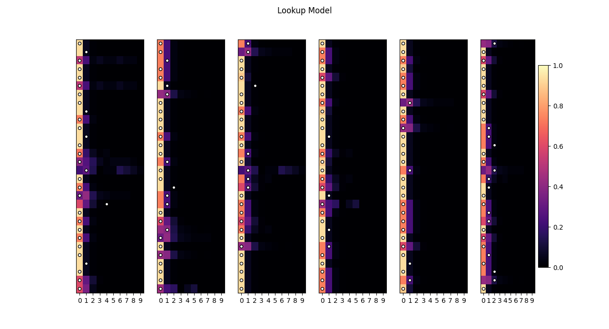
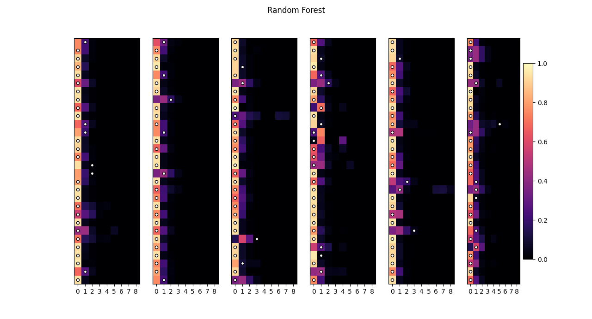
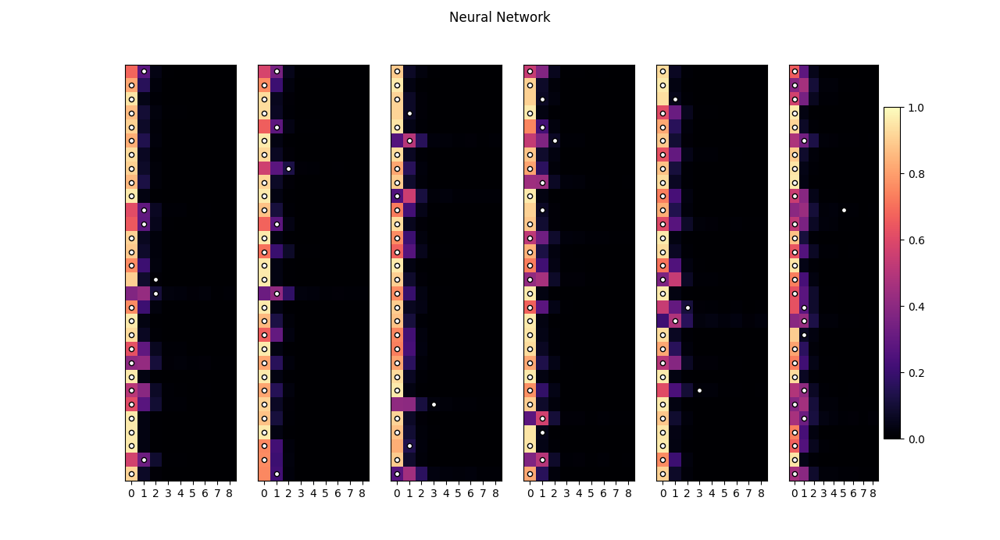
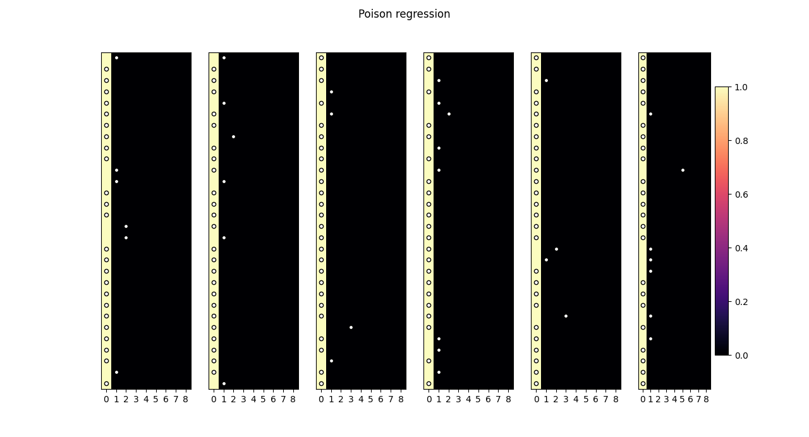
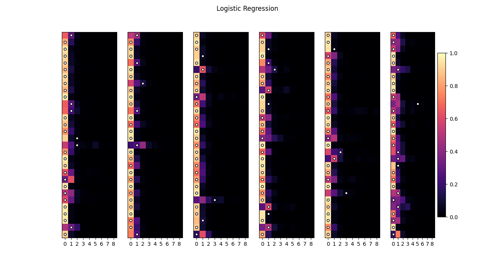
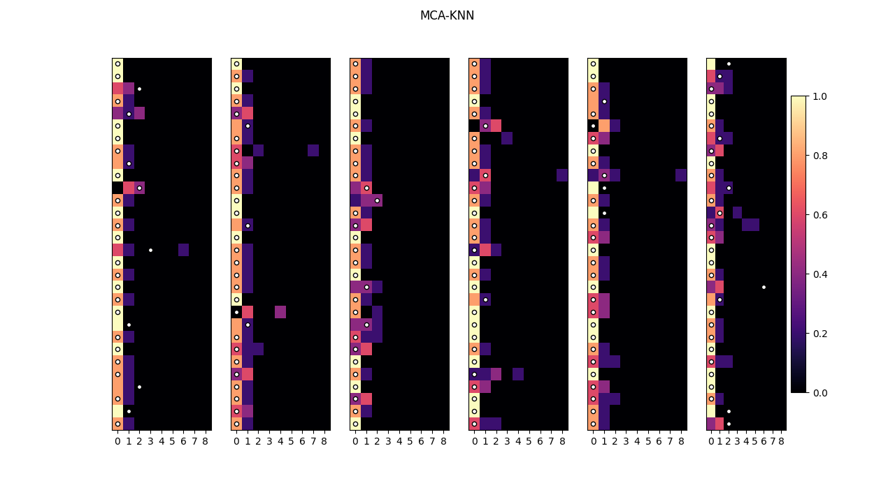
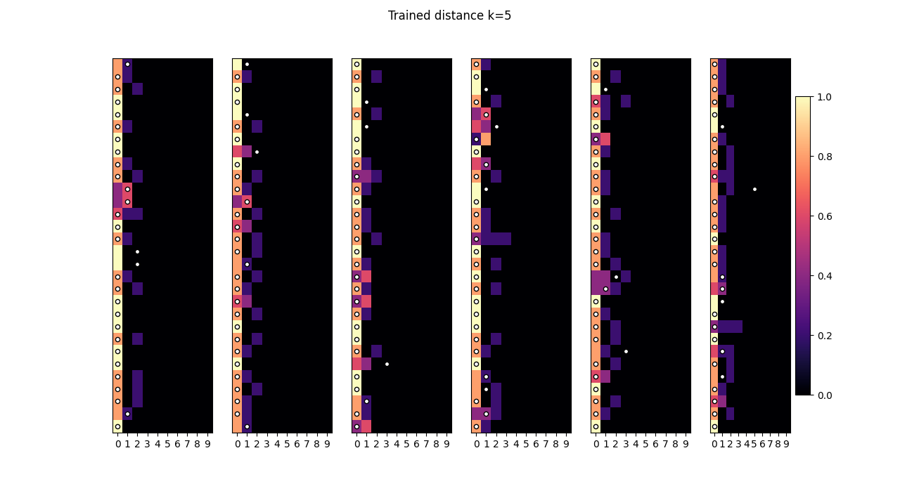

```{r setup, include=FALSE}
knitr::opts_chunk$set(echo = TRUE)
library(reticulate)
```


## Naive Bayes

The Naive Bayes model is a simple probabilistic classifier based on applying Bayes' theorem with strong independence assumptions. It is a popular method for text classification, but it can be used for any type of data. The model is
trained by estimating the probability of each class given the input data, and then it uses these probabilities to predict the class of new data points. The Naive Bayes model is known for its simplicity and speed, and it is often used as a baseline for comparison with more complex models. 

The model is based on the assumption that the features are independent. In our case, as shown by our analysis, this assumption is not realistic, but we are still interested in the performance of the Naive Bayes model as a baseline for comparison with more complex models.


```{python naive_bayes}

def training(verbose=False, plot=False, random_state=None, title='Naive Bayes'):
    data = Data()
    data.x_to_one_hot()
    data.y_to_one_hot()

    # keep only some columns
    names = ['actdays_0', 'actdays_10', 'actdays_14', 'age_0.27',
             'hscore_0', 'illness_0', 'income_0.55']

    data.keep_cols(names)

    x_train, x_test, y_train, y_test = data.train_test_split(random_state=random_state)

    y_train_values = np.argmax(y_train.values, axis=1)

    model = MultinomialNB()
    model.fit(x_train, y_train_values)
    y_pred = model.predict_proba(x_test)

    return evaluate(y_train, y_test, y_pred, verbose=verbose, plot=plot, title=title)

```


```
Performance

avg_rmse           0.190
avg_mabse          0.292
std_rmse           0.004
std_mabse          0.026
avg_dummy_rmse     0.194
avg_dummy_mabse    0.303
avg_training_time  0.079 s
std_training_time  0.004 s
```

These results have been obtained on a subsample of features, carefully selected to maximize the performance of the model.


## Lookup model

This very simple model makes prediction by averaging the values of the target variables that match the features of the input data-point. Despite it's simplicity, it can be a good baseline to compare with more complex models.

This model's weakness is that it can't predict unseen data-points, as it requires the exact same features to be present. Therefore, it is unable to generalize, and it can handle only few features at the time.


```{python lookup_model}

class Model(dict):

    def train(self, x_train, y_train, 
              names=('actdays_0', 'actdays_14', 
                     'prescrib_0', 'hospdays_0', 'hospadmi_0')):
        self['names'] = names
        self['y_size'] = y_train.shape[1]
        self['x_train'] = x_train
        self['y_train'] = y_train

    def predict(self, x_test):
        """
        The model outputs the average y_train of the x_train data-points
        with the correct values for the features
        """
        out = np.zeros((len(x_test), self['y_size']))
        names = self['names']
        for i, (index, x) in enumerate(x_test.iterrows()):
            indices = np.ones(len(self['x_train']), dtype=bool)
            for name in names:
                indices *= self['x_train'][name] == x[name]
            out[i] = self['y_train'][indices].mean(axis=0)
        return out


def training(verbose=False, plot=False, random_state=None, title='Lookup Model'):
    data = Data()
    data.x_to_one_hot()
    data.y_to_one_hot()

    x_train, x_test, y_train, y_test = data.train_test_split(random_state=random_state)

    model = Model()
    model.train(x_train, y_train)
    y_pred = model.predict(x_test)

    return evaluate(y_train, y_test, y_pred,
                    verbose=verbose, plot=plot, title=title)


```



```
Performance

avg_rmse           0.173
avg_mabse          0.288
std_rmse           0.004
std_mabse          0.021
avg_dummy_rmse     0.184
avg_dummy_mabse    0.296
avg_training_time  0.905 s
std_training_time  0.039 s
```

An extensive search for the best features shows that the following dummy features yield a model with comparatively decent performance: *actdays==0, actdays==14, prescrib==0, hospdays==0, hospadmi==0*.


## Random Forest

The random forest is an ensemble method that aggregates the predictions of several individual decision trees. Each tree is trained on a random subset of the data. Random forest uses a technique called bagging, that trains independently multiple decision trees by randomly sampling the training data with replacement.

```{python random_forest}

def training(verbose=False, plot=False, random_state=None, title='Random Forest'):
    data = Data()
    data.x_to_one_hot()
    data.y_to_one_hot()

    # keep only some columns
    names = ['actdays_0', 'actdays_14', 'actdays_6', 'age_0.22',
             'age_0.32', 'age_0.42', 'age_0.52', 'hospadmi_0',
             'hospadmi_1', 'hscore_0', 'hscore_8', 'income_0.06',
             'prescrib_0']
    data.x = data.x[names]

    x_train, x_test, y_train, y_test = data.train_test_split(random_state=random_state)

    y_train_values = np.argmax(y_train.values, axis=1)

    model = RandomForestClassifier(random_state=1)
    model.fit(x_train, y_train_values)

    y_pred = model.predict_proba(x_test)

    return evaluate(y_train, y_test, y_pred, verbose=verbose, plot=plot, title=title)

```




```
Performance

avg_rmse           0.186
avg_mabse          0.298
std_rmse           0.003
std_mabse          0.019
avg_dummy_rmse     0.194
avg_dummy_mabse    0.303
avg_training_time  0.187 s
std_training_time  0.006 s
```

Also for this model, features were carefully selected, as the model tends to learn spurious patterns from the limited data provided.


## Neural Network


```{python neural_net}

class Model(dict):
    """naive bayes"""
    def fit(self, x_train, y_train, random_state=42, verbose=True):
        y_train_values = np.argmax(y_train, axis=1)
        self['model'] = MLPClassifier(hidden_layer_sizes=(200, 100),
                                      activation="relu",
                                      alpha=0.001,
                                      learning_rate_init=1e-5,
                                      max_iter=500,
                                      random_state=random_state,
                                      tol=1e-4,
                                      verbose=verbose,
                                      n_iter_no_change=20,
                                      beta_1=0.99,
                                      beta_2=0.9)
        self['model'].fit(x_train, y_train_values)

    def predict(self, x_test):
        return self['model'].predict_proba(x_test)


def training(verbose=False, plot=False, random_state=None, title='Neural Network'):
    data = Data()
    data.keep_cols(['actdays', 'prescrib', 'hospadmi', 'illness', 'hscore', 'nondocco'])
    data.x_to_one_hot()
    data.y_to_one_hot()

    x_train, x_test, y_train, y_test = data.train_test_split(random_state=random_state)

    model = Model()
    model.fit(x_train, y_train, random_state=random_state, verbose=verbose)

    y_pred = model.predict(x_test)

    return evaluate(y_train, y_test, y_pred, verbose=verbose, plot=plot, title=title)


```



```
Performance

avg_rmse           0.182
avg_mabse          0.287
std_rmse           0.003
std_mabse          0.019
avg_dummy_rmse     0.195
avg_dummy_mabse    0.305
avg_training_time  44.66 s
std_training_time  9.656 s
```

Neural networks were able to reasonably minimize the mean absolute error of the prediction, even without a careful feature selection. In fact, the features used by this model are simply the ones with highest correlation with the target variable.  


## Poisson regression

Poisson regression is a statistical method used to model response variables that involve count data. It helps revealing which explanatory variables impact the target variable, making it particularly useful. It has been extensively researched and refined over time to address various practical scenarios.


```{python poisson}

class Model(dict):
    """naive bayes"""
    def fit(self, x_train, y_train, random_state=42, verbose=True):
        y_train_values = np.argmax(y_train, axis=1)
        self['model'] = PoissonRegressor(max_iter=1000)
        self['model'].fit(x_train, y_train_values)

    def predict(self, x_test):
        y_pred = self['model'].predict(x_test)
        y_pred = np.clip(y_pred, 0, 8)

        # convert y_pred to one-hot
        y_pred = np.eye(9)[y_pred.astype(int)]

        return y_pred


def training(verbose=False, plot=False, random_state=None, title='Poisson regression'):
    data = Data()
    data.keep_cols(['actdays', 'prescrib', 'hospadmi', 
                    'illness', 'hscore', 'nondocco'])
    data.x_to_one_hot()
    data.y_to_one_hot()

    x_train, x_test, y_train, y_test = data.train_test_split(random_state=random_state)

    model = Model()
    model.fit(x_train, y_train, random_state=random_state, verbose=verbose)

    y_pred = model.predict(x_test)

    return evaluate(y_train, y_test, y_pred, 
                    verbose=verbose, plot=plot, title=title)

```



```
Performance

avg_rmse           0.212
avg_mabse          0.302
std_rmse           0.006
std_mabse          0.029
avg_dummy_rmse     0.194
avg_dummy_mabse    0.302
avg_training_time  0.038 s
std_training_time  0.025 s
```

The Poisson regression on its own fails to make useful predictions due to the unbalanced nature of the data. 


## Logistic regression


Logistic regression is a statistical model commonly used for classification and predictive analytics. It estimates the probability of an event occurring based on a given dataset of independent variables. Logistic regression focuses on predicting binary outcomes, but can be extended to handle multiclass classification.

```{python logistic}

class Model(dict):
    """naive bayes"""
    def fit(self, x_train, y_train, random_state=42, verbose=True):
        y_train_values = np.argmax(y_train, axis=1)
        self['model'] = LogisticRegression(random_state=random_state, max_iter=1000)
        self['model'].fit(x_train, y_train_values)

    def predict(self, x_test):
        return self['model'].predict_proba(x_test)


def training(verbose=False, plot=False, random_state=None, title='Logistic Regression'):
    data = Data()
    data.keep_cols(['actdays', 'prescrib', 'hospadmi', 'illness', 'hscore', 'nondocco'])
    data.x_to_one_hot()
    data.y_to_one_hot()

    x_train, x_test, y_train, y_test = data.train_test_split(random_state=random_state)

    model = Model()
    model.fit(x_train, y_train, random_state=random_state, verbose=verbose)

    y_pred = model.predict(x_test)

    return evaluate(y_train, y_test, y_pred, verbose=verbose, plot=plot, title=title)

```



```
Performance

avg_rmse           0.181
avg_mabse          0.289
std_rmse           0.005
std_mabse          0.026
avg_dummy_rmse     0.195
avg_dummy_mabse    0.305
avg_training_time  0.172 s
std_training_time  0.018 s
```


## MCA-KNN

The MCA-KNN model is a combination of two methods: Multiple Correspondence Analysis (MCA) and K-Nearest Neighbors (KNN).

The purpose of MCA is to reduce the dimensionality the data. It is analogous to PCA, but specifically designed for categorical data. The output of MCA is a latent representation of the data, which is then used as input to the KNN model. In this form, the data points belonging to different classes are expected to be more separable.

The KNN model is a non-parametric method used for classification. It is based on the idea that similar data points are likely to belong to the same class. The model is trained by storing the training data, and then it classifies new data points based on their similarity to the training data. The model is simple and intuitive, but it can be sensitive to the choice of the number of neighbors and the distance metric. A big number of neighbors "k" can lead to underfitting, especially for categories with a low number of samples. On the other hand, a small number of neighbors can lead to overfitting.

```{python mca_knn}


class Model(dict):
    """naive bayes"""
    def fit(self, x_train, y_train, n_neighbors=10, 
            n_components=5, random_state=42, verbose=True):

        # learn a function to reduce dimensionality
        self['mca'] = MCA(n_components=n_components,
                          copy=True,
                          check_input=True,
                          engine='sklearn',
                          random_state=random_state,
                          one_hot=False
                          )

        self['mca'] = self['mca'].fit(x_train)
        reduced_x = self['mca'].row_coordinates(x_train).to_numpy()

        self['model'] = KNeighborsClassifier(n_neighbors=n_neighbors,
                                             weights="uniform",
                                             algorithm="auto",
                                             leaf_size=30,
                                             p=2,
                                             metric="minkowski")

        y_train_values = np.argmax(y_train, axis=1)

        self['model'].fit(reduced_x, y_train_values)

    def predict(self, x_test):
        reduced_data = self['mca'].row_coordinates(x_test).to_numpy()
        y_pred = self['model'].predict_proba(reduced_data)
        return y_pred


def training(verbose=False, plot=False, random_state=None, title='MCA-KNN',
             n_neighbors=5, n_components=10, n_ones_min=5):
    data = Data()
    data.keep_cols(['actdays', 'prescrib', 'hospadmi', 'illness', 'nondocco'])
    data.x_to_one_hot()
    data.y_to_one_hot()

    # remove columns with not enough 1s
    remove_cols = data.x.columns[(data.x.sum() <= n_ones_min)]
    data.remove_cols(remove_cols)

    if verbose:
        print(f'Columns with less than {n_ones_min} ones removed:')
        print(remove_cols)

    x_train, x_test, y_train, y_test = data.train_test_split(random_state=random_state)

    model = Model()
    model.fit(x_train, y_train,
              n_neighbors=n_neighbors, n_components=n_components,
              random_state=random_state, verbose=verbose)

    y_pred = model.predict(x_test)

    return evaluate(y_train, y_test, y_pred, verbose=verbose, plot=plot, title=title)

```



```
Performance

avg_rmse           0.189
avg_mabse          0.297
std_rmse           0.005
std_mabse          0.028
avg_dummy_rmse     0.194
avg_dummy_mabse    0.303
avg_training_time  0.102 s
std_training_time  0.038 s
```

This method could benefit from a better latent representation of the data. The main limitation in our case is that not many options exist when dealing with mostly categorical data. That is exactly what the next method tries to implement.


## Trained distance

This method consists on using neural networks to learn a distance between two data points, based on the difference between the values of the respective target features. During prediction, the new data point is compared to all the training data points, and the k closest data points are used to calculate the average of the target features.


```{python trained_distance}

class Model(dict):
    """Trained proximity knn model
    the model learns a distance between two data points
    """

    def fit(self, x_train, y_train, 
            random_state=42, data_size=20_000, epsilon=0.1):
        print('\nBuilding dataset\n')
        self['x_train'] = x_train
        self['y_train_onehot'] = y_train
        y_train_values = np.argmax(y_train, axis=1)
        self['y_train_values'] = y_train_values

        # create an empty matrix with the same number of columns as x_train
        x_diff = np.zeros((0, x_train.shape[1]))
        y_diff = []

        for _ in range(data_size):
            if _ % 10_000 == 0:
                print(f'building dataset {_}/{data_size}')
            i = np.random.randint(0, x_train.shape[0])
            j = np.random.randint(0, x_train.shape[0])

            if _ % 10 == 0:
                i = j

            x_i, x_j = x_train.iloc[i], x_train.iloc[j]
            x_abs_diff = np.abs(x_i - x_j)
            y_abs_diff = np.abs(y_train_values[i] - y_train_values[j])

            x_diff = np.vstack((x_diff, x_abs_diff))
            y_diff.append(y_abs_diff)

        y_diff = np.array(y_diff)
        y_diff = np.log(y_diff + epsilon)

        x_diff_train = pd.DataFrame(x_diff, columns=x_train.columns)
        y_diff_train = pd.DataFrame(y_diff, columns=['y_diff'])
        y_diff_train = np.ravel(y_diff_train)

        print(f'\nTraining model with {data_size} samples\n')
        # the model learns the distance between two data points
        self['model'] = MLPRegressor(hidden_layer_sizes=(200, 100),
                                     activation="relu",
                                     batch_size="auto",
                                     learning_rate="constant",
                                     max_iter=200,
                                     random_state=random_state,
                                     tol=1e-3,
                                     verbose=True
                                     )
        self['model'].fit(x_diff_train, y_diff_train)

    def predict(self, x_test, k=5):
        """
        check each row in x_test against each row in x_train, and
        return the average of y_train of the closest data points
        """
        y_pred = []
        y_train_onehot = self['y_train_onehot'].to_numpy()

        for i in range(x_test.shape[0]):

            if i % 100 == 0:
                print(f'predicting {i}/{x_test.shape[0]}')

            # compute the distance (y_proba) between x_test[i] 
            # and each x_train[j]
            x_i = x_test.iloc[i]
            x_diff = np.abs(self['x_train'] - x_i)
            x_diff = pd.DataFrame(x_diff, columns=x_test.columns)
            y_proba = self['model'].predict(x_diff)

            # join the distance with the y_train_values, then sort by distance, 
            # take the k closest data points
            v = list(zip(y_proba, y_train_onehot))
            v.sort(key=lambda x: x[0])
            v = v[:k]

            # take the average of the k closest data points
            new_y = np.mean([x[1] for x in v], axis=0)
            y_pred.append(new_y)

        return np.array(y_pred)


def training(verbose=False, plot=False, title='Trained distance', k=5):
    data = Data()

    # keep only some columns
    data.keep_cols(['actdays', 'prescrib', 'hospadmi', 'illness', 'hscore'])

    # normalize data
    for name in data.x.columns:
        data.x[name] /= data.x[name].max()

    data.x_to_one_hot()
    data.y_to_one_hot()

    x_train, x_test, y_train, y_test = data.train_test_split()

    model = Model()
    model.fit(x_train, y_train)

    y_pred = model.predict(x_test, k=k)

    return evaluate(y_train, y_test, y_pred, verbose=verbose, 
                    plot=plot, title=title + ' k=' + str(k))

```





```
Performance

avg_rmse           0.197
avg_mabse          0.350
std_rmse           0.003
std_mabse          0.004
avg_dummy_rmse     0.193
avg_dummy_mabse    0.350
avg_training_time  84.11 s
std_training_time  15.50 s
```

The poor performance of this method can be attributed to the fact that the noise in the data makes it really hard for the neural network to learn a meaningful distance among data points.
